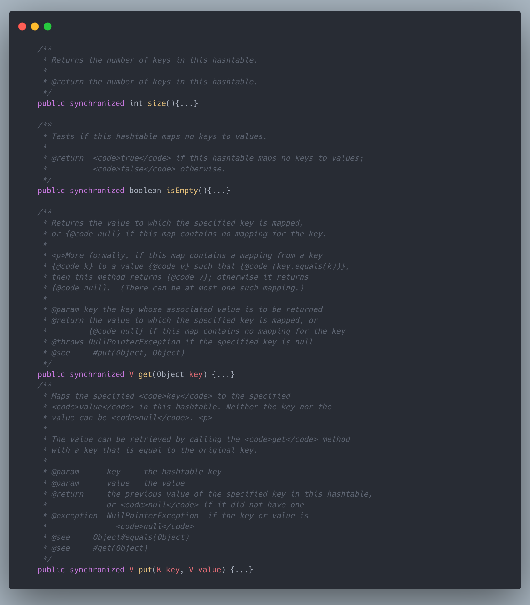
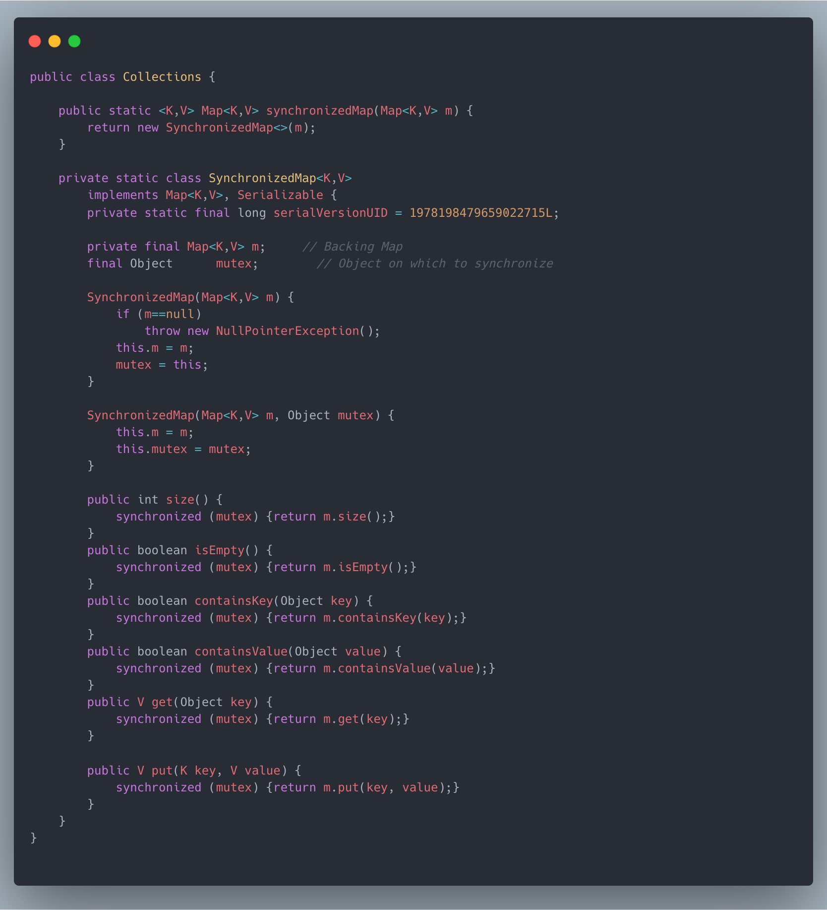
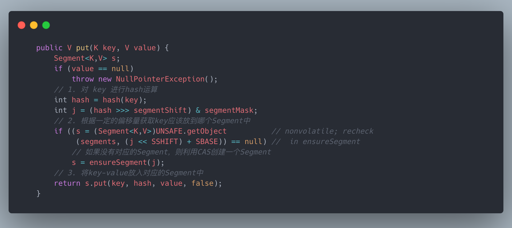
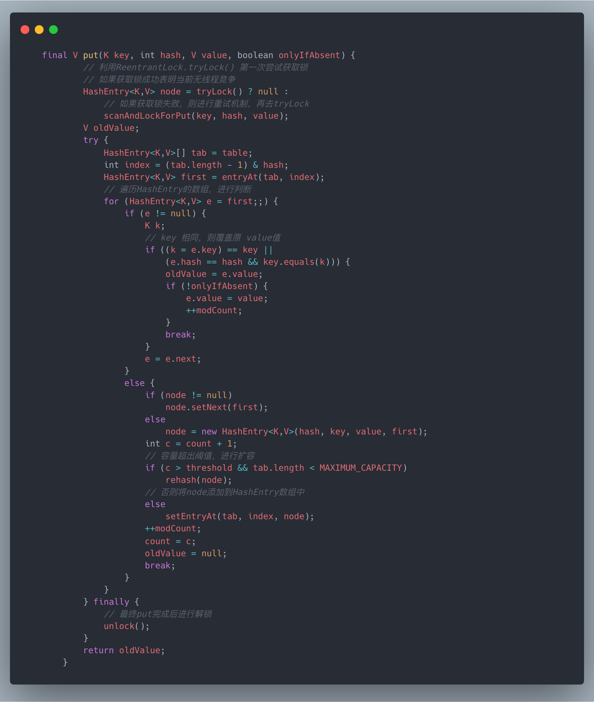

# ConcurrentHashMap

HashMap在多线程的情况下会产生线程安全的问题。比如1.7中的HashMap在多线程的情况下进行扩容会发生死循环。虽然在1.8中利用尾插法进行改良，但多线程下 还是会出现元素的覆盖，比如多个线程对同一个key进行put操作。

## 为什么要使用ConcurrentHashMap

为了解决线程安全的问题，在早期JDK版本中，有两种可选方案：

- HashTable
- Collections.synchronizedMap()

以上两种方式确实可以解决线程安全的问题，但是在多线程的情况下，除了线程安全的问题，我们还得考虑效率的问题，毕竟多线程就是为了提升处理数据的 效率。

1. 首先我们看一下HashTable的源码:

可以发现，几乎每个方法都加上了synchronized修饰，如果我们将HashTable中数据看成是一张表，那synchronized直接是 将整张表都锁住了。

2. 再看一下Collections.synchronizedMap()的源码：

`Collections.synchronizedMap()`返回的其实是一个静态内部类`SynchronizedMap`，在`SynchronizedMap`的put操作中也可以看见其实是利用
synchronized同步代码块将put操作进行加锁，加锁的对象就是SynchronizedMap内部一个排他锁对象mutex，这样就导致效率上和HashTable差不多了。

从效率上看，以上两种方案都是不推荐的，所以在JDK1.5版本中引入了一个ConcurrentHashMap， 从名称上我们就看出来这个专为多线程提供的高效率的线程安全的Map。

## ConcurrentHashMap 如何解决线程安全的问题

ConcurrentHashMap为了保证线程安全，内部也是通过加锁的方式实现，在JDK1.7和1.8中实现略有不同。

在JDK1.7中，ConcurrentHashMap是通过分段锁的方式进行加锁。

数据结构就是 Segment数组 + HashEntry数组 + 链表/红黑树。

具体实现原理就是将整张Hash表分成一个个的数据块(Segment)，在Segment内部再维护一个
HashEntry数组，用于存储对应的key-value，而且Segment还继承了ReentrantLock，用于对Segment进行加锁。

通过这样的结构，在多线程竞争的情况下只需要对一个个的Segment加锁即可，那些无线程竞争的Segment其实就无需加锁，也就是减少了加锁的粒度，从而提升效率。

下面通过JDK1.7中的ConcurrentHashMap源码来一探究竟：

1. 第一步根据对应的key确定Segment，如果没有，则新建Segment并通过CAS设置到Segment数组中

   
2. 第二步利用确定的Segment进行put操作
    2-1. 第一步尝试去获取锁，如果获取成功
    2-2. 

   

在JDK1.8中，对ConcurrentHashMap又进一步进行了优化，抛弃了Segment分段锁的模式，利用CAS + synchronized 的方式保证线程安全。