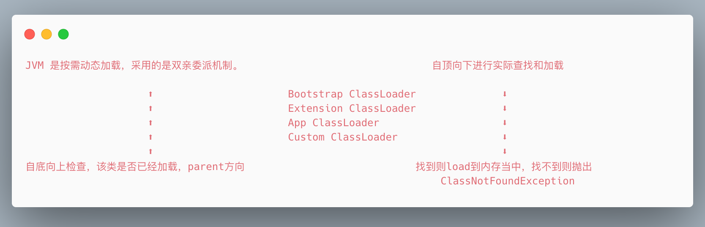
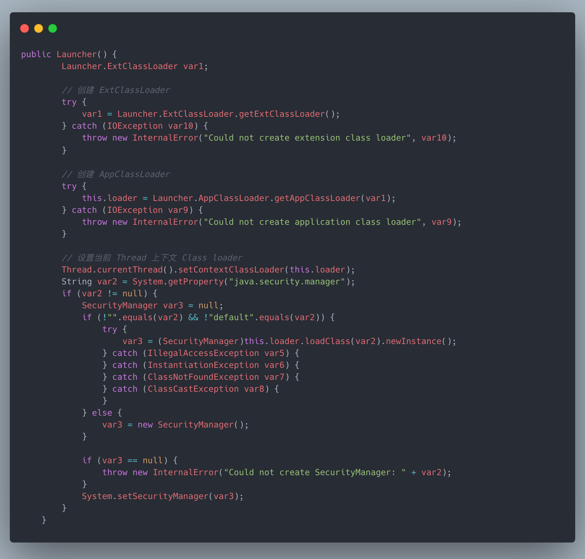
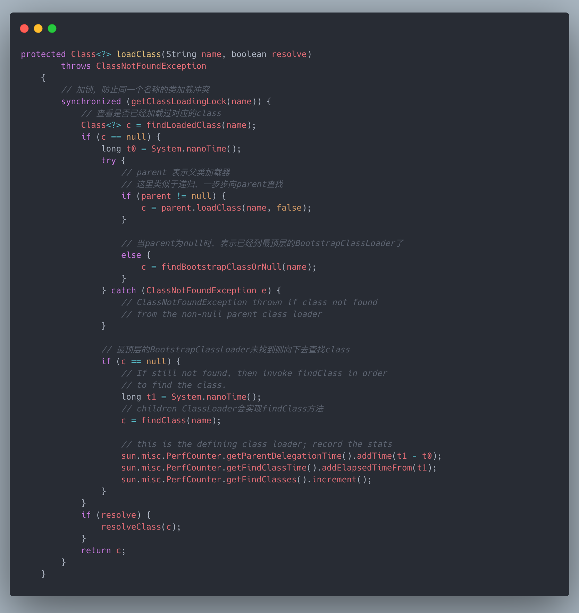
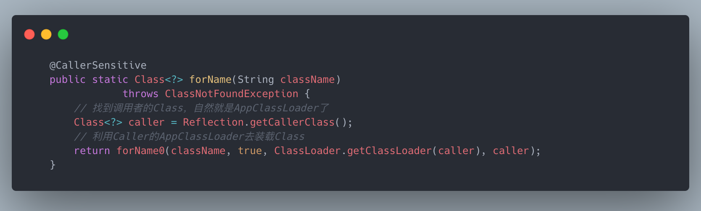
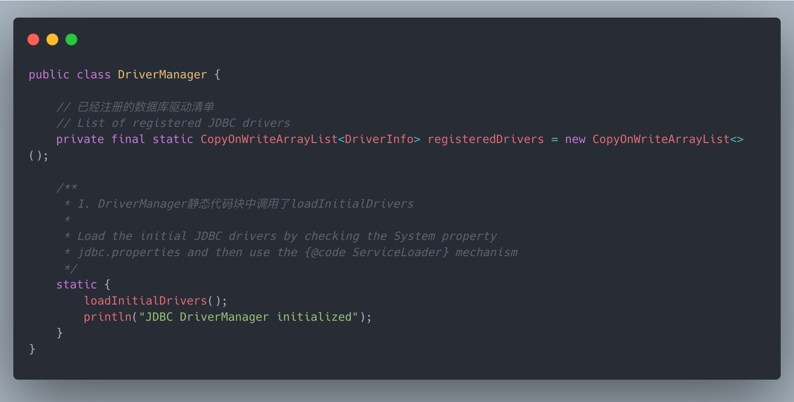
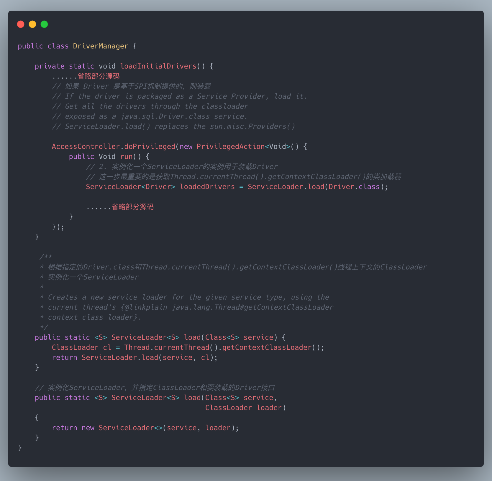
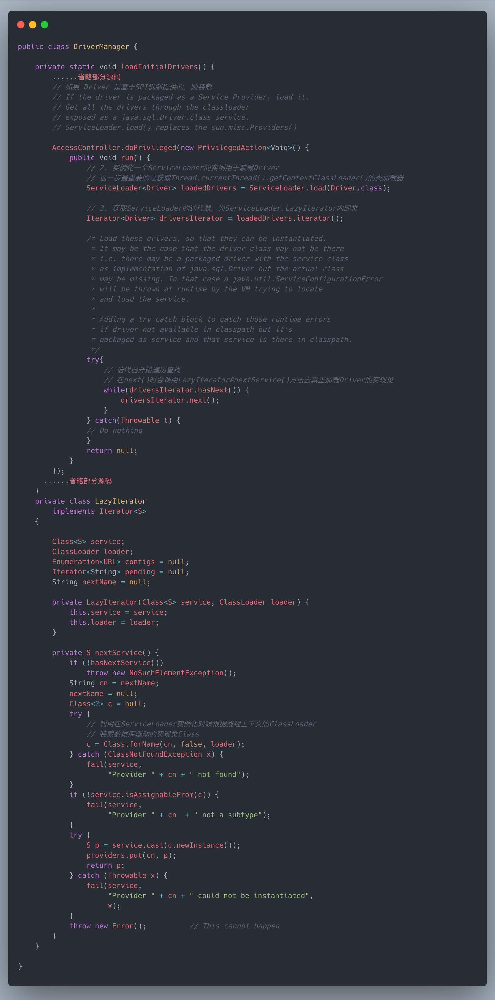
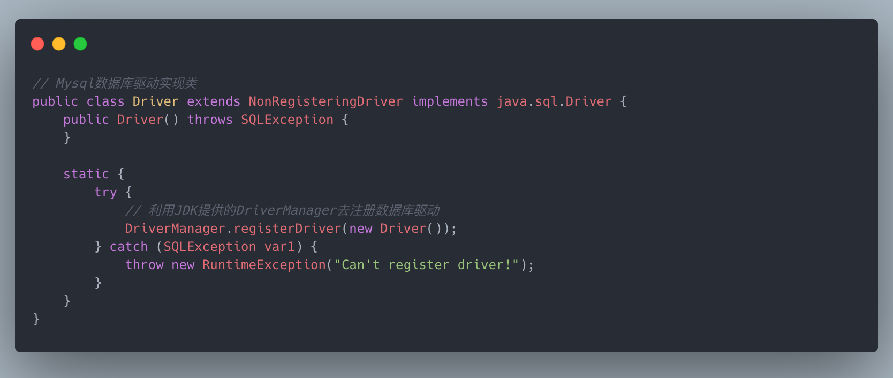
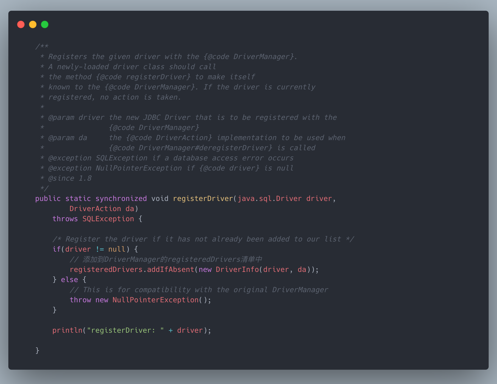
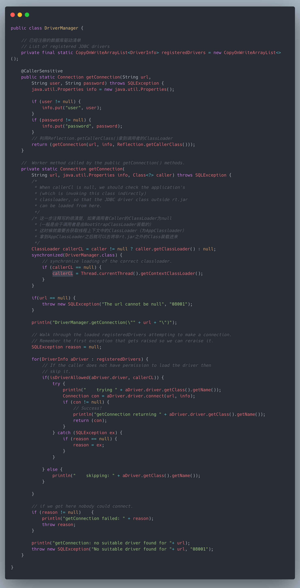

# 什么是类加载机制？
java虚拟机将描述类的数据从Class文件加载到内存，并对数据进行校验，转换、解析、初始化并最终形成可以被JVM
可以直接执行的指令，这个过程就可以被称之为虚拟机的类加载机制。

## 什么是类加载器？
实现通过一个类的全限定名来获取描述该类的二进制流的动作的代码就叫做类加载器。
类加载器主要分为以下几类：

- Bootstrap: 加载lib.rt charset.jar 等核心内容，。
- Extension: 加载扩展jar包，jre/lib/ext/*.jar
- App: 加载classpath的内容
- Custom Class Loader: 自定义类加载器

其中Bootstrap Class loader是JVM中最顶级的，由C++语言实现，获取Bootstrap类加载器会返回null。

## 双亲委派原则
一个类加载器收到类加载请求后不会立即先加载自己，而是先去让父级的加载器去检查缓存中，是否已经加载，层层迭代，到最顶层加载器都没有，
会往下进行委派去加载指定的类。

双亲委派机制的好处：

- 避免重复加载：资源浪费的问题，父类已经加载了，子类就不需要再次加载。 
  
- 保证了类加载的安全性：解决了各个类加载器的基础类的统一问题，如果不使用该种方式，那么用户可以随意定义类加载器来加载核心 API，会带来安全隐患。
  比如Object 类。它存放在 rt.jar 中，无论哪个类加载器要加载这个类，最终都是委派给处于模型顶端的启动类加载器加载， 因此 Object 类在程序的各种加载环境中都是同一个类。

*注：父加载器不是类加载器的加载器，也不是类加载器的父类加载器。*

下面就跟着ClassLoader的源码，一步步去发掘双亲委派机制的具体实现。

## Launcher
Launcher是java程序的入口，Launcher的ClassLoader是BootstrapClassLoader，在Launcher创建的同时，还会创建`ExtClassLoader`，`AppClassLoader`并且还将当前应用的
AppClassLoader设置到线程上下文中去（_这一步的作用在下文介绍破坏双亲委派机制-SPI时会用到，这里先埋个点_）。

## ClassLoader源码
ClassLoader 是一个抽象类，像 ExtClassLoader，AppClassLoader 都是由该类派生出来，实现不同的类装载机制。
在ClassLoader 中的loadClass是类装载的入口：

在装载Class之前首先会顺着parent方向(AppClassLoader -> ExtClassLoader->BootStrapClassLoader)去查看否已经装载过，如果装载过Class直接返回，当到达最顶层的BootStrapClassLoader之后如果依旧没没找到，则从parent往下去委托给子加载器去加载Class。

## 自定义类加载器
实现ClassLoader的钩子函数findClass

## 如何打破双亲委派机制

- 利用Thread.currentThread().getContextClassLoader();

- 重写ClassLoader的loadClass方法。

在探索如何打破双亲委派机制之前，我们首先有个疑问，这大牛们设计好的双亲委派机制我们为什么要去打破呢？

其实双亲委派机制也有它本身的缺陷，但是这个缺陷一般情况下涉及不到，所以就不太关心，从双亲委派机制的整体来看，加载类的是从上至下进行加载的，所以在顶层类加载器中加载的类是无法访问子加载器中加载的类，就像BootStrap加载器中加载的都是rt.jar中的Class，rt.jar中的class一般作为用户调用的api，一般情况下也不会去访问子加载器中的类库，目前也无法访问到，因为BootStrapClassLoader是顶层的类加载器。

而有些特殊情况，目前都是提倡面向接口编程，目的是为了松耦合，接口提供商和实现类提供商也不一定就是一家公司，所以jdk提供了一中SPI(Service Provider Interface)的机制，最鲜明的例子就是数据库驱动`java.sql.Driver`，`Driver`是JDK定义的数据库驱动规范接口，而Driver的实现类是由各家数据库提供商编写，而且JDK提供了`DriverManager`用于管理这些数据库的驱动。

在JDBC4.0之前，我们要加载数据库驱动，必须要先利用`Class.forName("com.mysql.jdbc.Driver");`将具体的数据库驱动实现类加载进来，`Class.forName`其实是利用了AppClassLoader进行加载，只要数据库驱动类在ClassPath中能找到即可。

在JDBC4.0之后，我们可以不需要再利用`Class.forName`手工加载数据库的驱动类，因为JDK中的SPI机制（在META-INF/services/目录下定义以接口全限定名的文件，文件的内容即接口的实现类全限定名），
JDK会利用`ServiceLoader.load`方法去扫描这些实现类。下面我们就以Mysql数据库驱动为例，从获取数据库连接的源码去分析整个过程：

1. 通常我们获取数据库的连接都是通过`DriverManager.getConnection(url, username, password)`;
   调用该方法首先会触发DriverManager的静态代码块，在`loadInitialDrivers()`中使用了`ServiceLoader`去查找那些Driver对应的SPI的描述文件。

   
2. 根据指定的接口Class(这里指的是Driver的接口)，并通过`Thread.currentThread().getContextClassLoader()`获取线程上下文的ClassLoader，
   然后实例化一个ServiceLoader，这里的获取到的ClassLoader其实就是AppClassLoader，关于线程上下文的ClassLoader就是在上面`Launcher`类中设置进去的。
   

3. ServiceLoader在内部类`LazyIterator#nextSerivice()`遍历的时候，使用第2步中的ClassLoader（实际就是AppClassLoader）去装载对应的Driver的实现类Class。

2. 当装载完成后，会触发MySql数据库驱动类`com.mysql.jdbc.Driver`的静态代码块：
   

   
3. 接着调用DriverManager.registerDriver将数据库驱动实现类添加DriverManager的驱动清单中。
   

   
4. 致此，利用DriverManager.getConnection()去获取数据库连接时就能顺利成章的拿到对应的驱动类了。
   

纵观JDK提供的SPI机制，由于DriverManager是rt.jar中的类，是由BootStrapClass进行装载的，而DriverManager在BootStrapClassLoader装载的时候却去利用线程上下文中的ClassLoader去装载Mysql数据库的驱动类，
这样就违背的了双亲委派的机制的原则。

- 重写ClassLoader的loadClass方法。
  从ClassLoader的源码可以看出，整个双亲委派的机制都是在ClassLoader#loadClass方法中定义的，所以想打破双亲委派的机制只需要重写loadClass方法
  即可。

>https://blog.csdn.net/cy973071263/article/details/104129163

## LazyInitializing
JVM规范中没有规定何时加载类，即按需加载
但是严格规定了什么时候必须初始化：
- new , get static, put static, invoke static指令，访问final修饰的变量除外
- java.lang.Reflect对类进行反射调用
- 初始化子类，必须先初始化父类
- 虚拟机启动时，被执行的主类必须初始化
- 动态语言支持java.lang.invoke.MethodHandle解析的结果为方法句柄时，该类必须初始化

## 编译
JVM中有三种编译模式
- 混合模式：-Xmixed，默认为混合模式
  * 混合使用解释器 + 热点代码编译
  * 起始阶段使用解释执行
  * 热点代码检测 
    1. 多次被调用的方法（方法计数器：检测方法执行频率）
    2. 多次被调用的循环（循环计数器：检测循环执行频率）
    3. 进行编译，会将这些字节码实时编译成目标机器码，以便提升性能
  
- 解释模式：-Xint: 使用解释执行模式，启动很快，执行稍慢
  
- 纯编译模式：-Xcomp:使用纯编译模式，执行很快，启动很慢

## 类加载的过程

Loading ->  Linking(verification -> preparation -> resolution) -> Initializing

- Loading: 装载 class 文件到内存。
  * 装载class文件的二进制到内存
  * 生成class类的对象，指向内存的二进制内容，我们使用Class类对象时，会自动找到指向内存中的二进制码，然后执行jvm指令。

- verification: 验证文件是否符合JVM规范

- preparation: class 静态变量赋默认值

- resolution: 将类、方法、属性等符号引用解析为直接引用
  constant pool 常量池中的各种符号引用解析为指针、偏移量等内存地址的直接引用

- Initializing: 赋初始值，执行静态代码块

## 面试题：对象的创建过程
1. class loading
2. class linking (verification, preparation, resolution)
3. class initializing
4. 申请对象内存
5. 成员变量赋默认值
6. 调用构造方法<init>
  - 成员比那里顺序赋初始值
  - 执行构造方法语句