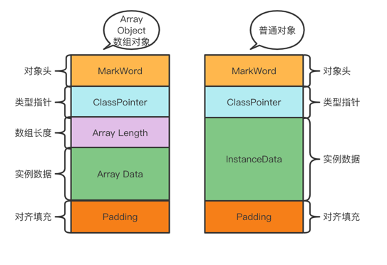

## 对象的创建过程
1. [class loading](../t02_class_loader)
2. class linking (verification, preparation, resolution)
3. class initializing
4. 申请对象内存
5. 成员变量赋默认值
6. 调用构造方法<init>
    - 成员比那里顺序赋初始值
    - 执行构造方法

## 对象在内存中的存储布局

关于该问题需要拆分为两种情况分析：

1. 普通对象：

- 对象头MarkWord: 8个字节

- ClassPointer: 属于哪个Class，-XX:+UseCompressedClassPointers 为4字节，否则为8字节。

- 实例数据InstantData：

    - 引用类型: -XX:+UseCompressedOops 开启则占4字节，否则占8字节


* 对齐填充Padding：保证对象的大小为8的整数倍。


2. 数组对象:

* MarkWord: 8个字节
* ClassPointer: 属于哪个class，-XX:+UseCompressedClassPointers 为4字节，否则为8字节。
* 数组长度: 4个字节
* 数组数据
* 对齐填充：保证对象的大小为8位的整数倍。

整个对象的结构大致如下图：



> https://www.jianshu.com/p/d42ac3ab41f7

## 对象的大小

对象的实际大小其实和虚拟机的配置有关联，我们可以通过`java -XX:+PrintCommandLineFlags -version` 输出当前JVM的配置信息：

```java
java -XX:+PrintCommandLineFlags -version
        
以下是笔者安装的JVM, 输出如下:
     -XX:InitialHeapSize=268435456
     -XX:MaxHeapSize=4294967296
     -XX:+PrintCommandLineFlags
     -XX:+UseCompressedClassPointers        // class pointer 压缩
     -XX:+UseCompressedOops                 // ordinary object pointer 普通对象的指针压缩
     -XX:+UseParallelGC 
java version "1.8.0_271"
Java(TM) SE Runtime Environment (build 1.8.0_271-b09)
Java HotSpot(TM) 64-Bit Server VM (build 25.271-b09, mixed mode)
```

在上面的输出信息有两个配置内容关系到一个对象的实际大小：

- -XX:+UseCompressedClassPointers: 表示开启 class pointer 指针压缩，class pointer 原始占用8个字节，开启压缩指针后占用4个字节，
  可以通过-UseCompressedClassPointers关闭指针压缩。
- -XX:+UseCompressedOops: 表示开启普通对象的指针压缩，原始对象引用指针占用8个字节，开启压缩指针后占用4个字节，
  可以通过-UseCompressedClassPointers关闭指针压缩。

知道上述两个因素之后，就可以大致计算出一个对象的具体大小：

```java
    /**
     * -XX:+UserCompressedClassPointers 为24
     * -XX:-UserCompressedClassPointers 为32
     * -XX:-UserCompressedClassPointers -XX:-UseCompressedOops 为 40
     */
    public static class P {
        // mark word 8 字节
        // class pointer 压缩为4字节，不压缩为8字节

        // int 类型为 4 个字节
        int a;
        int b;
        int c;

        // String 为引用类型，开启oops压缩占4个字节，正常占8个字节
        String s = "s";

        // padding 对其填充为 8 字节倍数
    }
```

### 小技巧利用 Agent 计算对象的大小

在ClassLoader中提到，一个Class文件通过ClassLoader load 到内存中的时候，我们可以通过在这个过程中增加一个 agent，
通过 agent 可以获取到对象的大小，具体步骤如下：

1. 新建一个 Module，添加ObjectAgent.java
```java
    public class ObjectAgent {
    
        static Instrumentation inst;
    		
      	// 该方法签名是固定的，就和main方法类似
        public static void premain(String args, Instrumentation _inst) {
            inst = _inst;
        }
    
      	// 计算对象的大小
        public static long sizeof(Object o) {
            return inst.getObjectSize(o);
        }
    }
```
2. 在 src 目录下添加 META-INF/MANIFEST.MF文件，内容为(注：最后必须另一一个空行)：
```
Manifest-Version: 1.0
Premain-Class: object_agent.ObjectAgent

```
3. 将该module打成jar包，添加到需要使用的module的library中

4. 添加启动VM参数：-javaagent:${ObjectAgent.jar的路径}

5. 调用ObjectAgent.sizeof(o);

   ```java
   public class ObjectSize {
   
       public static void main(String[] args) {
           Object o = new Object();
           System.out.println("new Object() 对象大小为：" + ObjectAgent.sizeof(o));
   
           // -XX:+UserCompressedClassPointers 为16
           // -XX:-UserCompressedClassPointers 为24
           T t = new T();
           System.out.println("new T() 对象大小为：" + ObjectAgent.sizeof(t));
   
           // -XX:+UserCompressedClassPointers 为24
           // -XX:-UserCompressedClassPointers 为32
           // -XX:-UserCompressedClassPointers -XX:-UseCompressedOops 为 40
           P p = new P();
           System.out.println("new P() 对象大小为：" + ObjectAgent.sizeof(p));
       }
   
       public static class T {
           // mark word 8 字节
           // class pointer 压缩为4字节，不压缩为8字节
   
           // int 类型为 4 个字节
           int a;
   
           // padding 对其填充为 8 字节倍数
       }
   
       /**
        * -XX:+UserCompressedClassPointers 为24
        * -XX:-UserCompressedClassPointers 为32
        * -XX:-UserCompressedClassPointers -XX:-UseCompressedOops 为 40
        */
       public static class P {
           // mark word 8 字节
           // class pointer 压缩为4字节，不压缩为8字节
   
           // int 类型为 4 个字节
           int a;
           int b;
           int c;
   
           // String 为引用类型，开启oops压缩占4个字节，正常占8个字节
           String s = "s";
   
           // padding 对其填充为 8 字节倍数
       }
   ```

   

## Hotspot虚拟机开启内存压缩的规则
1. 4G以下，直接砍掉高32位
2. 4G~32G，默认开启内存压缩 compressClassPointer compressOops
3. 32G，压缩无效，使用64位

所以内存并不是越大越好

## 对象头MarkWord具体包括什么

 分为几种情况讨论：
    - 无锁状态：
    - 偏向锁状态：如果对象调用过 identityHashCode，则对象无法进入偏向锁状态
    - 轻量级锁
    - 重量级锁
    - GC标记
对象的hashcode按原始计算System.identityHashCode生成的JVM会将其记录在markword中，但是一旦重写了对象的hashcode方法，则对象的hashcode不会
存储在markword中

对象的GC年龄最大为15，因为在markword对象头中，GC年龄只用了4bit进行保存。

|锁状态|25bit|

## 对象如何定位

- 句柄池(gc 效率比较高)：JVM需要划分出一块内存作为句柄池，句柄中存储的就是对象实例数据的地址和对象类型地址。
  * 缺点是：如果想访问对象完整的数据，要先经过句柄池，通过句柄池拿到对象在堆中的地址和对应的类型地址，经过三次才能获取到完整对象的数据，效率比较低。
  * 优点是：reference中存放的是稳定的句柄地址，当对象发生移动时（比如GC的Coping算法），只需要修改句柄中的对象实例指针数据即可。
    
- 直接引用（hotspot）：目前HotSpot虚拟机采用的就是这种方案，在reference中直接存储了对象的实例数据指针和类型指针，访问对象的效率更高，因为
节省了一次指针的定位。

参考文章：
>
> https://blog.csdn.net/clover_lily/article/details/80095580

