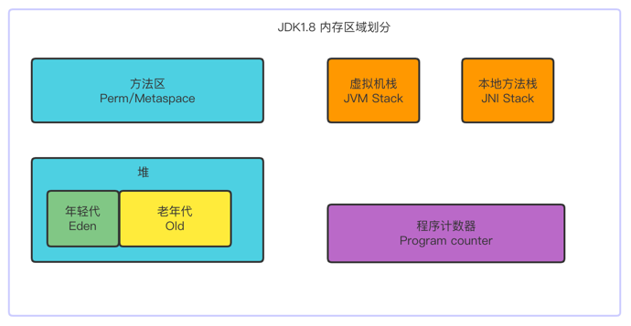

# JVM Runtime Data Area and JVM Instructions

## Runtime Data Area 运行时数据区



- JVM stacks：每个线程独享。虚拟机栈是由一个个的栈帧(stack frame)组成：是用于帮助虚拟机执行方法调用与方法执行的数据结构。
  每一个方法对应一个栈帧，线程独享，存储了以下内容：
  * Local Variables Table，局部变量表，hotspot的LocalVariables类似于寄存器
  * Operand Stack：操作数栈
  * Dynamic Linking：动态链接，比如在A() 方法中调用了B()，这时候需要去查找B()的符号链接。
  * return address: 返回地址，比如在A() 方法中调用了B()，B() 的返回值放在什么地方
- native method stacks: 本地方法栈，线程独享
- Program Counter：程序计数器，线程独享，每个线程都有它自己的程序计数器，是线程私有的，生命周期与线程的生命周期保持一致。
  之所以需要程序计数器，因为CPU对于线程是需要频繁切换执行，程序计数器就是为了在线程切换后，再切换回来知道下一步应该执行什么指令
  存放下一条指令，虚拟机的运行，类似于这样的循环
  ```java
        while(not end) {
            // 取 PC 中的位置，找到对应位置的指令
            // 执行指令
            // PC ++
        }
  ```
- Heap：堆，线程共享，根据分代模型，堆分为年轻代和老年代，年轻代又分为Eden和两个survivor区。
- method area: 方法区，线程共享
  JVM线程共享区域，存放 class 的结构
  具体实现分为：
  * JDK1.8之前的实现方式为 Perm Space 永久区，Full GC 不会清理
  * JDK1.8及之后的实现方式为 Meta Space 字符串常量位于堆，会触发GC 
- runtime constant pool
- Direct memory
  直接内存，JVM可以直接访问内核空间的内存，这个内存归操作系统管理，如网络IO，提高效率，实现0拷贝

关于虚拟机栈，首先得明白栈的数据结构是先进后出(FILO)。

- invokeinterface：调用接口中的方法，实际上是在运行期决定的，决定到底调用实现该接口的哪个对象的方法。
- invokestatic：调用静态方法。【重要】
- invokespectial：调用自己的私有方法、构造方法(<init>)以及父类的方法。
- invokevirtual：调用虚方法，在c++中是存在虚方法这个概念的，但是Java是不存在的，但是在字节码中是存在有虚方法的，运行期动态查找的过程。【重要】
- invokedynamic：动态调用方法。这是五个调用中最为复杂的，但是它是在JDK1.7之后才引用的，本身Java是一门静态的语言，但是通过一些引擎可以调用Javascript，这里了解一下既可。

1. 情况一
```java
    public static void main(String[] args) {
        int i = 8;
        i = i++;
        System.out.println(i);
    }
```

  对应的字节码：
```
    0 bipush 8        // 8 压栈
    2 istore_1        // 将 8 从栈中弹出，赋值给局部变量表索引为1的变量
    3 iload_1         // 将局部变量表索引为1的变量压栈
    4 iinc 1 by 1     // 将局部变量表索引为1的变量加1，这时局部变量表的值为9
    7 istore_1        // 栈中数据弹出，此时栈中的数据为8，赋值给局部变量表索引为1的变量
    8 getstatic #2 <java/lang/System.out : Ljava/io/PrintStream;>
    11 iload_1        // 将局部变量表索引为1进行压栈
    12 invokevirtual #3 <java/io/PrintStream.println : (I)V> // 将栈中的8弹出并打印
    15 return
```
2. 情况二
```java
    public static void main(String[] args) {
        Object t = new Object();
    }
```

  对应的字节码：
```
    0 new #2 <java/lang/Object>                         // new 对象 并将对象地址的引用压栈
    3 dup                                               // 复制一份对new出来对象的引用并压栈（这时候操作数栈中有两份地址引用并指向堆中的同一个对象）
    4 invokespecial #1 <java/lang/Object.<init> : ()V>  // 弹出一份地址引用，并调用构造方法
    7 astore_1                                          // 将栈中的引用弹出并赋值给局部变量表索引为1的变量
    8 return
```

3. 情况三
```java
    public static void main(String[] args) {
        Calculator c = new Calculator();
        c.p1();
    }
    
    // Calculator 类
    public class Calculator {
        public void p1() {}
    }
```

  对应的字节码：
```
    0 new #2 <jvm/dataarea/Calculator>                    // new 对象 并将对象地址的引用压栈
    3 dup                                                 // 复制一份对new出来对象的引用并压栈
    4 invokespecial #3 <jvm/dataarea/Calculator.<init> : ()V> // 执行构造方法
    7 astore_1                                                // 将引用弹出赋值给局部变量表
    8 aload_1                                               // 将局部变量表压栈
    9 invokevirtual #4 <jvm/dataarea/Calculator.p1 : ()V>   // 执行p1方法
    12 return
```
4. 情况四
```java

    public static void main(String[] args) {
        Calculator c = new Calculator();
        c.p1();
    }
    public class Calculator {
    
        public int add(int a, int b) {
            int c = a + b;
            return c;
        }
    }
```
  对应的字节码为：
```
   0 sipush 200                               // 200 压栈
   3 istore_1                                 // 弹出赋值给局部变量表[1]
   4 bipush 100                               // 100 压栈
   6 istore_2                                 // 弹出赋值给局部变量表[2]
   7 new #2 <jvm/dataarea/Calculator>         // new 对象 并将地址引用压栈
  10 dup                                      // 赋值对象引用压栈
  11 invokespecial #3 <jvm/dataarea/Calculator.<init> : ()V>  // 弹出对象引用执行构造方法
  14 astore_3                                 // 将栈中对象引用赋值给局部变量表[3]即 c
  15 aload_3                                  // 将局部变量表[3]即 c 压栈
  16 iload_1                                  // 将局部变量表[1]即 200 压栈
  17 iload_2                                  // 将局部变量表[2]即 100 压栈
  18 invokevirtual #4 <jvm/dataarea/Calculator.add : (II)I>   // 弹出c, 100, 200 并 执行c.add(100, 200)
  21 pop                                      // add 方法执行返回值会放在栈顶，因为没有接受返回值，最后会pop弹出
  22 return
  
  ## 对应的Calculator 的 byte code
  0 iload_1                                   // 100 压栈
  1 iload_2                                   // 200 压栈
  2 iadd                                      // 相加
  3 istore_3                                  // 将结果弹出赋值给局部变量表[3]即c
  4 iload_3                                   // 将局部变量表[3]压栈
  5 ireturn                                   // 将栈中的结果返回
```

在实例方法的局部变量表的下标为0存放的是this
## JVM 常用指令
- _store_：弹栈
- _load_n：压栈
- invoke_
  * invokeStatic
  * invokeVirtual
  * invokeInterface:
    ```java
        List<int> list = new ArrayList<>();
        list.add(1); // 这里就会是invokeInterface
    
        ArrayList<int> list2 = new ArrayList<>();
        list2.add(1); // 这里就会是invokevirtual
    
  * invokeSpecial：可以直接定位的，不需要多态的方法，private，constructor
  * invokeDynamic: lambda表达式，CGLib，反射