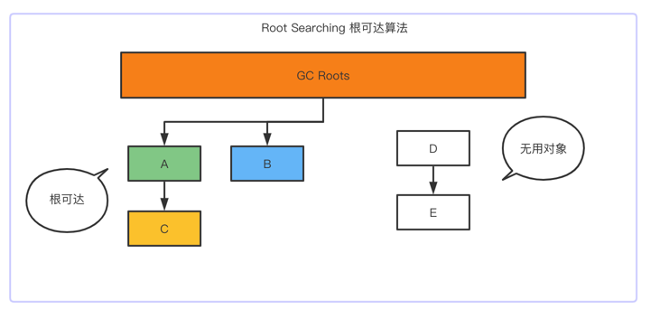
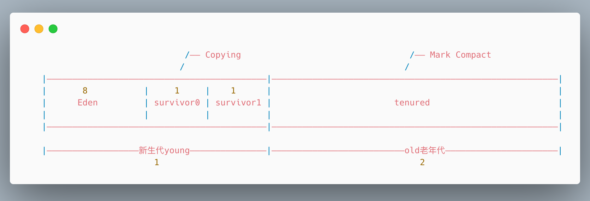
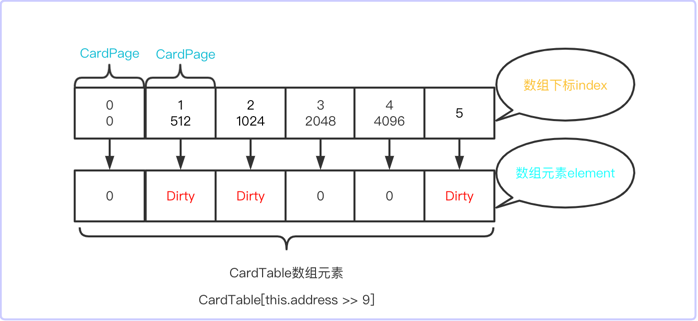

# Garbage Collector 垃圾回收器

## 什么是Garbage
没有任何引用指向一个对象或者多个对象（多个对象之间循环引用）

## 如何定位Garbage
- reference count: 引用计数，简单来说就是给对象添加一个引用计数器，每当对象被引用一次就加1，引用失效时就减1。当为0的时候就判断对象不会再被引用。
- root searching: 根可达算法，给定一个集合的引用作为根出发，通过引用关系遍历对象图，能被遍历到的（可到达的）对象就被判定为存活，
  其余对象（也就是没有被遍历到的）就自然被判定为死亡。



由于引用计数的算法存在无法解决循环引用的的问题，所以目前的垃圾回收器的查找需要回收的对象都是采用的根可达算法。
  
### GC Roots 根对象
1. 固定的根对象包含：
  * JVM stack：虚拟机栈(栈桢中本地变量表)中引用的对象，即所有Java线程当前活跃的栈帧里指向GC堆里的对象的引用；换句话说，当前所有正在被调用的方法的引用类型的参数/局部变量/临时值。
  * native method stack：本地方法栈中JNI(即一般说的Native方法)中引用的对象
  * runtime constant pool：运行时常量池引用的对象，（如String字符串常量）
  * static reference in method area：方法区中类静态属性
  * Class：方法区中Class对象

2. 非固定的根对象：跨代引用的对象，比如老年代中某些对象引用了年轻代的对象的时候，这时候的老年代的某些对象也需要加入GC Roots 进行扫描。

### GC Roots 根对象的枚举
JVM经过这么多年的进步，现如今主流的垃圾回收器为了能够减少GC占用的资源，已经能够做到在**部分垃圾回收的阶段**实现并发标记，并发清理，在用户线程运行的同时，去进行垃圾的回收，
从而避免长时间挂起用户线程。

_为什么说是部分阶段实现并发标记，清理呢？_

这是由于目前主流的JVM的垃圾回收器仍然都是基于准确式的垃圾回收，在去定位那些需要回收的无用的对象就需要非常的精确，所以在GC的
某些阶段（比如 根对象的枚举）还是需要暂停用户线程，但是这些阶段暂停的时间也都是可控的。

基于根可达算法，在GC的初始阶段，必然要对根对象进行精确的查找，所以必须进行STW（Stop the world）暂停用户线程， 否则整个GC就没有办法真正的实现准确式的垃圾回收。
虽然进行了STW，但是这个过程暂停的时间很短，原因在于，第一是由于GC Roots 对象相对于堆中大大小小的对象来说一般不会很多，第二是JVM进行了一系列的优化。

下面我们就看看JVM在这一步骤中进行的两种优化：

#### 对固定根对象扫描的优化
在固定根对象中，其中虚拟机栈是运行时产生的，每个线程运行时对应一个栈，一个栈又由多个栈帧组成，一个栈帧对应着一个方法，GC线程进行扫描时，需要去扫描线程栈上内存的区域，以确定
在虚拟机栈的本地变量表中哪些地方对堆中的对象持有引用关系。

而扫描整个虚拟机栈并非易事，因为GC回收只应该只关心那些是Reference类型的数据，而那些非Reference类型的，如果GC线程也进行了扫描，那就是对资源和时间的浪费。
所以JVM就想了一个办法，可以利用空间换时间的方式，JVM在扫描虚拟机栈的时候为了避免全栈扫描而采用了一种OopMap（Ordinary Object Pointer Map）的数据结构。

>可以把oopMap简单理解成是调试信息。 在源代码里面每个变量都是有类型的，但是编译之后的代码就只有变量在栈上的位置了。OopMap就是一个附加的信息，告诉你栈上哪个位置本来是个什么东西。
>这个信息是在JIT编译时跟机器码一起产生的。因为只有编译器知道源代码跟产生的代码的对应关系。

>对于JIT编译后的某些方法也会在特定的一些位置去维护OopMap，这些位置称为安全点(Safe Point)，之所以要选择一些特定的位置来记录OopMap，
>是因为如 果对每条指令（的位置）都记录OopMap的话，这些记录就会比较大，那么空间开销会显得不值得。选用一些比较关键的点来记录就能有效的缩小需要记录的数据量，但仍然能达到区分引用的目的。因为这样，HotSpot中GC不是在任意位置都可以进入，而只能在safepoint处进入。

通过OopMap，这样GC线程就避免了去扫描整个堆栈，直接去OopMap中找到那些属于GC Roots的引用，开始进行遍历，这样可以大大缩小根节点枚举的时间。

>https://www.cnblogs.com/plxx/p/4217812.html

### 对非固定根对象扫描的优化

## 垃圾回收算法
- Mark sweep: 标记清除，容易内存碎片化
- Copying: 拷贝，将内存分为两份，当需要垃圾回收时，先将有效内存数据copy到另外一份，并且连续，然后将第一部分的内存整个回收，此算法存在内存浪费的情况，但是效率高，适合用于存活对象比较少的情况。
- Mark compact: 标记压缩， 在标记的同时对碎片内存进行压缩，即需要移动对象，这样可以减少碎片并且没有内存浪费，但是效率偏低。

## JVM 分代内存模型（用于分代垃圾回收算法）
这里需要注意的是并不是所有的垃圾回收器都是采用的分代模型，比如Epsilon， ZGC， Shenandoah。
但目前大多数的还是依旧采用的分代模型，所以以下内容都是基于分代模型进行讨论：



1. 新生代 young = Eden + s0 + s1
2. 老年代 old
3. 1.7的时候还有PermGen 永久代/ 1.8 叫元数据区MetaSpace
    1.7PermGen永久代和1.8中的MetaSpace有什么区别？
    - 永久代和元数据区都是存放Class对象，Class字节码，包括动态生成的Class
    - 1.7的时候永久代必须指定大小限制，1.8中的元数据区可以设置大小，无上限（受限于物理内存大小，当占用过大会被Linux Killer杀掉）
    - 字符串常量1.7存放在MethodArea方法区/PermGen，1.8存放在堆中，String#intern()方法会将堆中的字符串移动到永久代。
    - MethodArea逻辑上的概念，1.7 就是永久代，1.8就是MetaSpace

## TLAB(Thread Local Allocation Buffer)
线程本地分配缓存
一个线程专用的内存分配区域，为了加速对象分配
每一个线程，都会产生一个TLAB，该线程独享的工作区域
每一个线程，都会默认使用TLAB区域
TLAB用来避免多线程冲突问题，提高对象分配效率。
TLAB缺省情况下仅占有整个Eden空间的1%，也可以通过选项`-XX:TLABWasteTargetPercent`设置TLAB空间所占用Eden空间的百分比大小。
    
## 对象内存分配的过程

对于小对象：
1. new 对象
2. 优先尝试在栈上分配，在栈上分配有以下优点：
    - 线程私有小对象
    - 无逃逸，只是在一段代码里使用，出了这段代码即无法找到
    - 支持标量替换
    - 栈上使用直接弹出pop，也不需要垃圾回收器处理
    
3. 如果栈上分配不下，则尝试在线程本地缓存TLAB中分配空间（其实也是Eden区）
    - 多线程的时候不需要竞争Eden区就可以申请空间，提高效率
    
4. 线程本地缓存分配不下，则直接进入线程共享的Eden区
   

对于大对象：则直接进入老年代。

## GC 的过程分析

对于采用分代回收的垃圾回收器来说：
YoungGC大多数对象都会被GC，所以在新生代采用Copying算法去清除。
第一次YGC之后活着的对象都会进入survivor0。
第二次YGC的时候，将存活的Eden + s0 的对象全部copy到survivor1中，这时候直接清除Eden和survivor0中的内存。
...就这样反复循环
当遇到以下情况，则进入老年代。

## GC何时触发

YGC: Eden空间不足

FullGC：Old空间不足，System.gc();

## 对象何时会进入老年代

- 超过`-XX:MaxTenuringThreshold`指定的次数（YGC次数， 最大为15，因为对象头MarkWord中对象年龄占4位。
    * Parallel Scavenge 默认为15
    * CMS 默认为 6
    * G1 默认为 15
- 动态年龄：
  在HotSpot虚拟机中，并不是严格的要求对象的年龄必须达到MaxTenuringThreshold才进行晋升到老年代，因为如果严格按照此规则会产生如下问题：
  - 如果MaxTenuringThreshold设置的过大，如果新生代大量对象都没有达到这个阈值，就会导致对象不能及时的晋升到老年代，从而导致新生代晋升的机制
    没有效果。
  - 如果MaxTenuringThreshold设置的过小，就会导致新生代对象晋升过早，从而快速的撑满老年代的空间，从而频繁引发Major GC，影响效率。
    

所以Hotspot虚拟机，为了能够适应不同程序的内存状况，使用了动态年龄机制，具体变现为：
s1 + Eden存活对象 copy到 s2 中，如果超过s2的50% 则将年龄最大的进入老年代区域，这时候的MaxTenuringThreshold就会被设置为此次晋升的年龄大小，
其中50%这个阈值可以通过`-XX:TargetSurvivorRatio`进行设定。


老年代空间满了之后会触发一次FullGC或者叫MajorGC，这种GC会产生 Stop The World现象。

所以GC调优（Generation）目标： 尽量减少Full GC

## 常见的垃圾回收器

到 JDK13 目前已经产生 10 种垃圾回收器
运用在young新生代的垃圾回收器有：

- Serial
- ParNew
- Parallel Scavenge
  

运用在Old老年代的垃圾回收器有：
- CMS
- Serial Old
- Parallel Old
  

以上的垃圾回收器都是基于分代模型。

穿插运用的垃圾回收器有：
- G1：逻辑分代，物理不分代，三色标记算法
- ZGC：颜色指针，Class Pointer算法
- Shenandoah
- Epsilon

### 分代模型中常见垃圾回收器组合

1. Serial + SerialOld:串行化回收，现在不常见
2. Parallel Scavenge + Parallel Old，JDK 1.8 默认的垃圾回收器
3. ParNew + CMS 
4. G1

### Serial 年轻代串行化回收
当触发YGC的时候，会STW(stop the world) ，然后利用单个的GC线程去进行垃圾回收，单CPU效率高，虚拟机client模式默认的垃圾回收器。


### Serial Old
运用在老年代，使用 Mark Compact 标记压缩算法，原理同 Serial

### Parallel Scavenge 年轻代并行化回收
当触发YGC的时候，会STW(stop the world) ，然后利用多个GC线程并行的去进行垃圾回收。


### Parallel Old
运用在老年代，原理同 Parallel

### Parallel New 年轻代并行化回收
与Parallel Scavenge 类似，当触发YGC的时候，会STW(stop the world) ，然后利用多个GC线程并行的去进行垃圾回收。
与Parallel Scavenge 的区别是该垃圾回收器和CMS配合使用

### CMS - ConcurrentMarkSweep 老年代
CMS Concurrent Mark Sweep，从名字就可以看出CMS是并发的，CMS是老年代的垃圾回收器，垃圾回收线程可以和用户程序同时运行，
减轻Stop the world（200ms），是JDK1.4后期引入，是里程碑式的，开启了并发回收的大门。

CMS垃圾回收过程：

分为四个阶段：
1. 初始标记InitialMark：这个阶段是STW的，但是因为从根对象开始标记，通过GC Roots 往下标记一级，所以STW的时间很短。
2. 并发标记ConcurrentMark，这个阶段是最耗时的，但是由于是并发执行的，所以不会产生STW，不影响用户线程。
3. 重新标记Remark，这个阶段是STW的
4. 并发清理

参考资料：
> https://docs.oracle.com/javase/8/docs/technotes/guides/vm/gctuning/toc.html
> https://www.cnblogs.com/webor2006/p/11055468.html
>

#### 如何解决跨代引用? - CardTable

有一种情况的跨代引用如果按照简单的根可达算法进行扫描会产生性能问题，比如：老年代对象持有年轻代对象的引用，在年轻代进行YGC的时候，如果要确定年轻代对象是否没有被老年代对象引用指向，
就需要去扫描整个老年代，从而产生性能问题，所以为了解决这个问题，就需要记录下这些跨代引用的关系。

CardTable也利用了物理内存中的Page页概念，JVM也是将堆内存分为一个个大小为2的幂次方的一个个CardPage，每个Card Page大小介于128~512个字节，而**CardTable的数据结构其实就是一个字节数组**，
在数组中记录哪些CardPage是Dirty，具体实现如下：

首先在JDK声明CardTable的源码大致如下(假设设定的CardPage的大小为512个字节)：
```txt
CardTable[this.address >> 9] = 0;
```
将当前空间的起始地址值向右移9位（即除以2的9次方，512）得到整个CardTable，所以CardTable的每个元素的索引即代表0, 512, 1024....对应的CardPage起始地址，依次类推，

从上图可以看出，起始数组对应的下标 `index * CardPageSize` 即每一个CardPage的起始地址值，CardTable数组中的每个元素即代表CardPage是否为Dirty。
这样当老年代引用了年轻代的对象的时候，就会通过写屏障(Write Barrier)将老年代对象所在的CardPage标记为Dirty，这样在GC进行回收标记的时候，就可以避免去扫描整个老年代，
直接去扫描CardTable找到哪些为Dirty的CardPage即可，所以在CMS中叫Points-Out(我引用了谁)。


在并发情况下，如果多个线程都产生了写屏障，必然会影响程序的性能能，所以JVM利用-XX:+UseCondCardMark进行判断，如果当期CardPage已经标记为Dirty，则不进行操作，
所以通过这个判断减少并发写操作，可以避免在高并发情况下可能发生的并发写卡表问题。

#### CMS 的缺点
由于CMS问题比较多，所以并不是主要的垃圾回收器， 只是配合ParallelNew，CMS主要有以下缺点：

- 内存碎片化：由于采用 Mark-Sweep标记清除算法，必然会产生碎片化。
- 浮动垃圾：在CMS的并发清理过程，由于有用户线程正在运行，原本已经被垃圾回收器标记为存活的对象，这时候突然指向的引用又断开，这时候变成了垃圾对象，所以产生新的垃圾，称为浮动垃圾。

基于以上两个缺点，当产生大量碎片和浮动垃圾之后，在Eden区或者survivor区对象升级到老年代时，发现没有足够连续的内存
可用，就会导致CMS启动Serial Old 进行Mark-Compact-Sweep标记压缩清除垃圾，当硬件内存很大的时候，这个过程会消耗大量时间。

解决办法：
- -XX:CMSFullGCsBeforeCompaction
- -XX:CMSInitiatingOccupancyFraction 92% 可以修改为68%，意思即让CMS保持老年代足够的空间。

#### CMS垃圾回收器常用参数

-XX:+UseConcMarkSweepGC
-XX:ParallelCMSThreads CMS线程数量
-XX:CMSInitiatingOccupancyFraction 使用多少比例的老年代后开始CMS收集，默认是68%(近似值)，如果频繁发生SerialOld卡顿，应该调小，（频繁CMS回收）
-XX:+UseCMSCompactAtFullCollection 在FGC时进行压缩
-XX:CMSFullGCsBeforeCompaction 多少次FGC之后进行压缩
-XX:+CMSClassUnloadingEnabled
-XX:CMSInitiatingPermOccupancyFraction 达到什么比例时进行Perm回收
GCTimeRatio 设置GC时间占用程序运行时间的百分比
-XX:MaxGCPauseMillis 停顿时间，是一个建议时间，GC会尝试用各种手段达到这个时间，比如减小年轻代

#### 案例分析：
有一个50万PV的资料类网站（从磁盘提取文档到内存）原服务器32位，1.5G 的堆，用户反馈网站比较缓慢，因此公司决定升级，新的服务器为64位，
16G 的堆内存，结果用户反馈卡顿十分严重，反而比以前效率更低了。

### G1 - Garbage First Collector

在G1之前的分代模型的垃圾回收器都是将VM的堆内存分为两块连续的，一个年轻代一个老年代，但是随着硬件内存容量的变大，垃圾回收器面对的内存也随之变大，
堆空间越大，存储的对象越多，对象图结构越复杂，每次垃圾回收需要扫描的对象而产生的停顿时间自然就更长久，虽然垃圾回收器都采用了一些手段来优化了这个过程，比如CardTable就是为了防止去扫描整个老年代空间。
但是这种优化也是有限的，所以在G1的出现就是解决这种越来越大内存的给GC带来的压力。

与其他垃圾回收器的很大的区别在于G1 只是在逻辑分代，而物理上不分代，**并且面对大内存，G1采用了分而治之的思想**。
在G1中，堆被分为很多个大小相同的区域(Region)，每个区域有可能是老年代Old，Humongous(Humongous是大对象，当Humongous的大小超过Region一半是，使用多个连续的Humongous来存放)，
也有可能是新生代Eden，Survivor，并且每个Region的分代也不是固定和连续的。

在传统的垃圾回收器中，新生代和老年代的比例为1：2，而在G1中，新生代和老年代的空间比例在5%-60%，会动态调整，这是G1预测停顿时间的基准。

#### G1 Mixed GC


#### CSet（CollectionSet） 和 Rset(Remembered Set)

CSet: 一组可被回收的分区的集合，在CSet中存活的数据会在GC的过程中被移动到另一个可用的分区，CSet中的分区可以来自Eden，Survivor，Old，CSet会占用不到整个堆空间的1%大小。

RSet: 在RSet中记录了其他Region中对象对当前Region中对象的引用，RSet可以使得垃圾回收期不需要扫描整个堆就可以找到谁引用了当前Region中的对象。只需要扫描RSet就可以。
G1中的RSet是Points-into（谁引用了我）。

RSet的数据结构类似于一个HashTable，key存放的是引用当前Region的对象所在的Region的起始地址，value是一个数组，记录指向当前Region的对象所在的CardTable的数组下标。

> https://www.cnblogs.com/webor2006/p/11123522.html
> https://docs.oracle.com/javase/8/docs/technotes/guides/vm/gctuning/g1_gc.html
>
> https://tech.meituan.com/2016/09/23/g1.html

## 垃圾收集器和内存大小的关系

1. Serial 几十M
2. PS 上百M ~ 几个G
3. CMS ~ 20 G
4. G1 上百G
5. ZGC 4T

## GC 的三色标记算法

GC进行垃圾回收前需要对垃圾对象进行标记，具体采用的根可达算法(root searching)，在GC线程中对所有存活对象进行标记的过程中，会给对象标记上三种颜色，
分别为黑，白，灰。

- 黑色：根对象，或者对象已经被扫描到，并且自己引用的对象都已经被扫描过。
- 白色：表明对象从未被扫描到。
- 灰色：表明对象自身被扫描到，但是自己引用的对象还未被扫描过。

当标记结束时，那些白色的对象就会被GC认为是垃圾对象，进行回收。

### 三色标记的漏标

三色标记算法还存在一种漏标的情况：即当灰色对象对某一个白色对象的引用断开，这时候，一个黑色对象重新又增加了对前面白色对象的引用，这时GC线程标记的时候
发现黑色对象已经被扫描过，所以不会重新再进行扫描，这样就会导致这个白色对象明明是有引用指向，但是却被GC回收了，导致了程序的运行错误。 伪代码如下：

```java
BlackObj blackObj = new BlackObj();
GrayObj grayObj = new GrayObj();
WhiteObj whiteObj = new WhiteObj();

// 初始情况
blackObj.whiteObj = null;
grayObj.whiteObj = whiteObj;

// 程序运行中
// 灰色对象引用的白色对象断开
grayObj.whiteObj = null;
// 黑色对象增加对白色对象的引用
black.whiteObj = whiteObj;

// GC 漏标，回收了whiteObj
```
主要分为4个阶段：
1. 初始标记 Initial Mark：该过程会产生STW现象，但是时间很短，因为该过程只是标记GC Roots 能直接关联的对象。
2. 并发标记 Concurrent Mark：该过程可以和用户线程同时运行，会从GC Roots标记完的对象开始递归的进行标记所有根可达对象。
3. 重新标记 Remark
4. 并发清理 Concurrent Sweep

从以上情况可以分析得出，产生漏标必须同时满足以下两个条件：
- 灰色对象断开了对白色对象的引用
- 黑色对象重新引用了断开的白色对象的引用

所以解决漏标的方式就要从以上两个条件下手，只需要打破其中一条规则即可解决漏标的问题。
而关于以上两个过程，其实可以在其中的某一个过程中添加一个类似于AOP拦截器， 在断开对象或者重新引用对象的时候进行拦截，这种拦截又称为写屏障和读屏障：

- 写屏障：
  * Incremental Update：增量更新，当对象持有的引用增加时，会将对象重新标记为灰色，CMS垃圾回收器使用的方案，所以在黑色对象重新增加对白色对象
    的引用的时候，会增加当前对象的引用数量，从而将当前黑色对象重新标记为灰色。
  * SATB(Snapshot At The Beginning)：增量更新，当对象持有的引用增加时，会将对象重新标记为灰色，CMS垃圾回收器使用的方案。

CMS: 三色标记算法 + Incremental Update
G1(10ms): 三色标记算法 + SATB(Snapshot At The Beginning) 
ZGC(1ms): ColoredPointers + 写屏障
Shenandoah: ColoredPointers + 读屏障

1.8 默认的垃圾回收器是 Parallel Scavenge + Parallel Old


#JVM 调优

## 第一步，了解生产环境下的垃圾回收器组合

JVM参数分类：
- 标准：- 开头，所有的Hotspot都支持，如java -version
- 非标准：-X，特定版本HotSpot支持
- 不稳定：-XX开头，下个版本可能会取消

`-XX:+PrintCommandLineFlag`

查看JVM默认配置： `java -XX:+PrintFlagsInitial`，可以配合 grep 进行搜索
查看修改更新配置：`java -XX:+PrintFlagsFinal`
- = 没有修改过
- := 修改过

## 常见垃圾回收器组合参数设置

- `-XX:+UseSerialGC`: Serial New + Serial Old，适合用于比较小的程序，但并不是默认就是这种选项，Hotspot会根据具体的配置和JDK的版本自动
选择收集器。

- `-XX:+UseParNewGC`：ParNew + Serial Old，这种组合很少用（某些版本已经弃用）
- `-XX:+UseConcMarkSweepGC`： ParNew + CMS + Serial Old 
- `-XX:+UseParallelGC`：Parallel Scavenge + Parallel Old， JDK 1.8 默认。
- `-XX:+UseParallelOldGC`：Parallel Scavenge + Parallel Old
- `-XX:+UseG1GC`: 使用G1

## GC 日志分析
```java
public class HelloGC {

    public static void main(String[] args) {
        System.out.println("Hello GC");
        List<byte[]> list = new LinkedList<>();

        for(;;) {
            byte[] b = new byte[1024 * 1024];
            list.add(b);
        }
    }
}
```
通过以下命令执行 T01:
```
java -XX:+PrintCommandLineFlags     // 打印命令行参数
     -XX:+PrintGCDetails            // 打印GC详细日志
     -Xmx20m -Xms20m                // 最大堆20M 最小堆20M
     HelloGC                        // 编译完的class
```

控制台输出：

```
leofeeMacBook-Pro:java-learning leofee$ java -XX:+PrintCommandLineFlags -XX:+UseParallelGC -XX:+PrintGCDetails -Xmx20m -Xms20m jvm.t05_gc.T01_HelloGC
-XX:InitialHeapSize=20971520 -XX:MaxHeapSize=20971520 -XX:+PrintCommandLineFlags -XX:+PrintGCDetails -XX:+UseCompressedClassPointers -XX:+UseCompressedOops -XX:+UseParallelGC 
Hello GC


[GC (Allocation Failure) [PSYoungGen: 4780K->416K(6144K)] 4780K->4520K(19968K), 0.0017916 secs] [Times: user=0.00 sys=0.01, real=0.01 secs] 
[GC (Allocation Failure) [PSYoungGen: 5646K->352K(6144K)] 9750K->9576K(19968K), 0.0020060 secs] [Times: user=0.00 sys=0.00, real=0.00 secs] 
[Full GC (Ergonomics) [PSYoungGen: 352K->0K(6144K)] [ParOldGen: 9224K->9493K(13824K)] 9576K->9493K(19968K), [Metaspace: 2675K->2675K(1056768K)], 0.0034673 secs] [Times: user=0.01 sys=0.00, real=0.00 secs] 
[Full GC (Ergonomics) [PSYoungGen: 5335K->1024K(6144K)] [ParOldGen: 9493K->13589K(13824K)] 14828K->14613K(19968K), [Metaspace: 2676K->2676K(1056768K)], 0.0032675 secs] [Times: user=0.01 sys=0.00, real=0.01 secs] 
[Full GC (Ergonomics) [PSYoungGen: 5217K->5120K(6144K)] [ParOldGen: 13589K->13589K(13824K)] 18806K->18709K(19968K), [Metaspace: 2676K->2676K(1056768K)], 0.0039851 secs] [Times: user=0.01 sys=0.00, real=0.00 secs] 
[Full GC (Allocation Failure) [PSYoungGen: 5120K->5120K(6144K)] [ParOldGen: 13589K->13577K(13824K)] 18709K->18697K(19968K), [Metaspace: 2676K->2676K(1056768K)], 0.0030686 secs] [Times: user=0.00 sys=0.00, real=0.00 secs] 

Exception in thread "main" java.lang.OutOfMemoryError: Java heap space
	at jvm.t05_gc.T01_HelloGC.main(T01_HelloGC.java:17)
	
Heap
 PSYoungGen      total 6144K, used 5327K [0x00000007bf980000, 0x00000007c0000000, 0x00000007c0000000)
  eden space 5632K, 94% used [0x00000007bf980000,0x00000007bfeb3c58,0x00000007bff00000)
  from space 512K, 0% used [0x00000007bff80000,0x00000007bff80000,0x00000007c0000000)
  to   space 512K, 0% used [0x00000007bff00000,0x00000007bff00000,0x00000007bff80000)
 ParOldGen       total 13824K, used 13577K [0x00000007bec00000, 0x00000007bf980000, 0x00000007bf980000)
  object space 13824K, 98% used [0x00000007bec00000,0x00000007bf942678,0x00000007bf980000)
 Metaspace       used 2707K, capacity 4486K, committed 4864K, reserved 1056768K
  class space    used 291K, capacity 386K, committed 512K, reserved 1048576K

```

从上述日志分析日志格式如下：


堆占用情况如下：                                            

```                                                 
                                        年轻代总大小
                                 (Eden + 一个survivor区)      内存起始空间地址       内存占用地址       内存空间结束地址
                                          /                      /                   /                      /
                Heap                     /                      /                   /                      /
            PSYoungGen      total 6144K, used 5327K [0x00000007bf980000, 0x00000007c0000000, 0x00000007c0000000)
  Eden    --    eden space 5632K, 94% used [0x00000007bf980000,0x00000007bfeb3c58,0x00000007bff00000)
survivor0 --    from space 512K, 0% used [0x00000007bff80000,0x00000007bff80000,0x00000007c0000000)
survivor1 --    to   space 512K, 0% used [0x00000007bff00000,0x00000007bff00000,0x00000007bff80000)

ParOldGen       total 13824K, used 13577K [0x00000007bec00000, 0x00000007bf980000, 0x00000007bf980000)
                    object space 13824K, 98% used [0x00000007bec00000,0x00000007bf942678,0x00000007bf980000)
                    Metaspace       used 2707K, capacity 4486K, committed 4864K, reserved 1056768K
                    class space    used 291K, capacity 386K, committed 512K, reserved 1048576K
```

## 调优前的基础概念
1. 吞吐量：用户代码时间/(用户代码时间 + 垃圾回收时间)
2. 响应时间： STW 时间越短，响应时间越好 
   

在不同场景下有不同的调优方向：
- 科学计算的吞吐量优先
- 网站以及API接口相应时间优先

什么是调优
- 根据需求进行JVM的规划和预调优
- 优化JVM运行环境
- 解决JVM运行中出现的各种问题，比如OOM

调优，从规划开始，以下大致的调优步骤：
1. 熟悉业务场景
   - 响应时间，停顿时间(CMS G1 ZGC)
   - 吞吐量，PS
2. 选择垃圾回收器的组合
3. 计算内存需求
4. 选定CPU
5. 设定年代大小，升级年龄阈值
6. 设定日志参数
    - -Xloggc:/opt/xxx/logs/xxxx-xxx-gc-%t.log 
        -XX:+UseGCLogFileRotation
        -XX:NumberOfGCLogFiles=5
        -XX:GCLogFileSize=20M
        -XX:+PrintGCDetails
        -XX:+PrintGCDateStamps
        -XX:+PrintGCCause
    - 或者每天产生一个日志文件
7. 观察日志情况

## 线上出现CPU飙升如何解决

### 纯命令行方式

1. `top` 命令查看是哪个进程占用CPU高或者直接使用`jps`查看java相关进程
2. `top -Hp <pid>` 查看进程中哪个线程占用CPU高，然后将线程ID转换为16进制数，因为在JVM中，堆栈的ID都是以16进制显示的，这里可以利用chrome
   浏览器的控制台转换。
3. `jstack <pid> | grep <nid> -A 20`，利用`jstack`查看线程中的堆栈信息，并匹配步骤2中转换的线程ID对应的16进制（grep -A 20 表示查找到之后显示）
后续的20行。
```text
"pool-1-thread-50" #57 prio=5 os_prio=0 tid=0x00007f883c206800 nid=0x10678b waiting on condition [0x00007f87f5bda000]
   java.lang.Thread.State: WAITING (parking)
	at sun.misc.Unsafe.park(Native Method)
	- parking to wait for  <0x00000000ffe66b60> (a java.util.concurrent.locks.AbstractQueuedSynchronizer$ConditionObject)
	at java.util.concurrent.locks.LockSupport.park(LockSupport.java:175)
	at java.util.concurrent.locks.AbstractQueuedSynchronizer$ConditionObject.await(AbstractQueuedSynchronizer.java:2039)
	at java.util.concurrent.ScheduledThreadPoolExecutor$DelayedWorkQueue.take(ScheduledThreadPoolExecutor.java:1088)
	at java.util.concurrent.ScheduledThreadPoolExecutor$DelayedWorkQueue.take(ScheduledThreadPoolExecutor.java:809)
	at java.util.concurrent.ThreadPoolExecutor.getTask(ThreadPoolExecutor.java:1074)
	at java.util.concurrent.ThreadPoolExecutor.runWorker(ThreadPoolExecutor.java:1134)
	at java.util.concurrent.ThreadPoolExecutor$Worker.run(ThreadPoolExecutor.java:624)
	at java.lang.Thread.run(Thread.java:748)
```
4. 利用`jstack <pid> > <pid>.tdump`导出线程栈的信息，栈信息文件通常以`.tdump`结尾
5. 利用`jmap`导出堆信息，通过 `jmap -histo <pid> | head -20` 也可以分析堆中实例的数量及占用堆空间的大小。
   **这里需要注意的是，jmap 导出堆转储文件会影响服务器的性能，所以一般情况下是不允许直接dump的，也可以在JVM启动时加入如下参数，在发生OOM的时候**
   自动生成堆转储文件`-XX:+HeapDumpOnOutOfMemoryError -XX:HeapDumpPath=/tmp`
```txt 
[root@VM-16-16-centos ~]# jmap -histo 1075022 | head -20

 num     #instances         #bytes  class name
----------------------------------------------
   1:        766338       55176336  java.util.concurrent.ScheduledThreadPoolExecutor$ScheduledFutureTask
   2:        766364       30654560  java.math.BigDecimal
   3:        766338       24522816  T03_HelloGC$CardInfo
   4:        766338       18392112  java.util.Date
   5:        766338       18392112  java.util.concurrent.Executors$RunnableAdapter
   6:        766338       12261408  T03_HelloGC$$Lambda$2/1044036744
   7:             1        3594640  [Ljava.util.concurrent.RunnableScheduledFuture;
   8:          1606         126136  [C
   9:           717          82368  java.lang.Class
  10:          1594          38256  java.lang.String
  11:           790          35904  [Ljava.lang.Object;
  12:            10          25232  [B
  13:            56          21056  java.lang.Thread
  14:           188          10528  java.lang.invoke.MemberName
  15:           275           9856  [I
  16:           276           8832  java.util.concurrent.ConcurrentHashMap$Node
  17:           180           7200  java.lang.ref.SoftReference
```
导出堆文件 `jmap -dump:format=b,live,file=<pid>.hprof <pid> `，导出完成之后可以下载到本地机器.
6. 利用jvisualvm进行分析
- jvisualvm为jdk的bin下，利用该命令即可启用
- 装入下载下来的堆转储文件
7. 利用jhat进行分析
这里需要注意的是有时候导出的堆转储文件很大，如果直接使用jhat命令会报堆空间不足的错误，所以可以利用`jhat -J-mx512m <dump_file>`进行分析。
jhat分析完成之后会在本地启动一个服务，端口为7000；

### 利用阿里开源工具Arthas

> 

## OutOfMemory OOM 常见报错

1. `Exception in thread "main" java.lang.OutOfMemoryError: GC overhead limit exceeded`
   产生原因：这种错误主要是由于程序运行时，垃圾回收占用的时间比例太大，实际执行运算的时间比例很小即GC线程垃圾回收占用时间超过98%并且GC回收的内容少于2%。

   样例，利用死循环不断的往map中put值堆分配为` -Xmx10m -Xms10m`：

   ```java
   		public static void addRandomDataToMap() {
           Map<Integer, String> dataMap = new HashMap<>();
           Random r = new Random();
         	// 不断的往map中put
           while (true) {
               dataMap.put(r.nextInt(), String.valueOf(r.nextInt()));
           }
       }
   
       public static void main(String[] args) {
           addRandomDataToMap();
       }
   ```

   产生原因：

      - 堆内存分配的过小
      - 存在内存泄漏

   解决方案：

   - 通过-Xmx和-Xms调整堆内存大小
   - 查找内存泄漏的代码

2. `java.lang.OutOfMemoryError: Java heap space`
   堆空间溢出。

   样例，线程池使用了无界队列如LinkedBlockingQueue，任务量大的时候会导致大量队列任务产生。

   产生原因：

    - 这种错误主要是由于程序运行时发生了内存泄漏，导致某些对象无法被GC回收，时间一长就会产生OOM。
    - 存在大对象的内存分配。

3. PermGen 永久代，JDK1.7中的概念，在PermGen保存了class信息还有一些杂项比如字符串常量。

   `-XX:PermSize`：设置持久代(perm gen)初始值，默认值为物理内存的1/64

   `-XX:MaxPermSize`：设置持久代最大值，默认为物理内存的1/4


4. Metaspace 这个是JDK1.8提出来的概念，称为元数据区，在JDK1.7中称为永久代Perm，主要用来存放class类信息
   `-XX:MetaspaceSize`:表示JVM首次元数据区空间不够时进行GC的阈值，默认为20m。
   
   `-XX:MaxMetaspaceSize`受限于物理内存大小。
   
   大量的动态生成class，比如反射，Lambda表达式，代理类的生成，可能会导致OOM产生
   
5. `
   java.lang.OutOfMemoryError : unable to create new native Thread
   `

   大量的创建线程

6. `
   java.lang.OutOfMemoryError: Requested array size exceeds VM limit
   `

   声明了超出VM限制的数组，在为数组分配内存之前，JVM 会执行一项检查。要分配的数组在该平台是否可以寻址(addressable)，如果不能寻址(addressable)就会抛出这个错误。

7. `
   java.lang.OutOfMemoryError: Out of swap space
   `

8. `java.lang.OutOfMemoryError: stack_trace_with_native_method`


## 常见JVM参数

1. Xmx: 堆内存的最大Heap值，默认为物理内存的1/4。默认当空余堆内存小于指定阈值时，JVM会增大Heap到-Xmx指定的大小。
2. Xms: 堆内存的最小Heap值，默认为物理内存的1/64，但小于1G。默认当空余堆内存大于指定阈值时，JVM会减小heap的大小到-Xms指定的大小。
   
    Xmx, Xms 设置为一样的好处：为了避免在生产环境由于heap内存扩大或缩小导致应用停顿，降低延迟，同时避免每次垃圾回收完成后JVM重新分配内存。所以，-Xmx和-Xms一般都是设置相等的。
    >https://zhuanlan.zhihu.com/p/394762019
    
3. Xmn: 