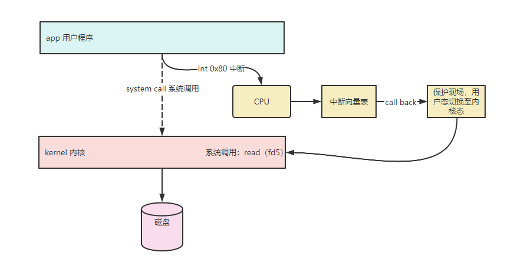
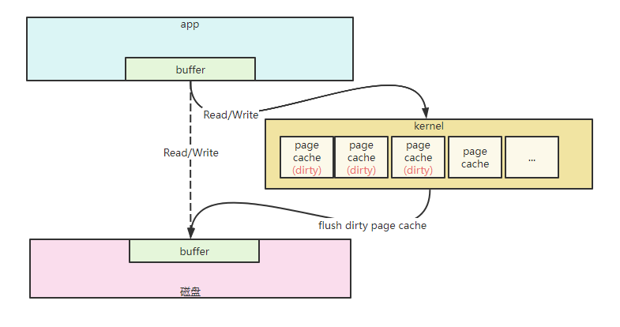
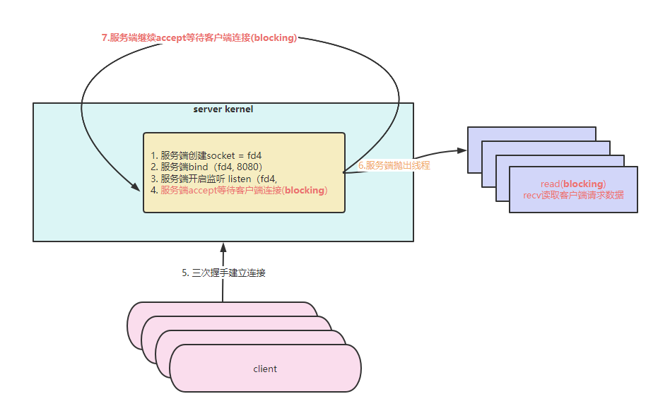
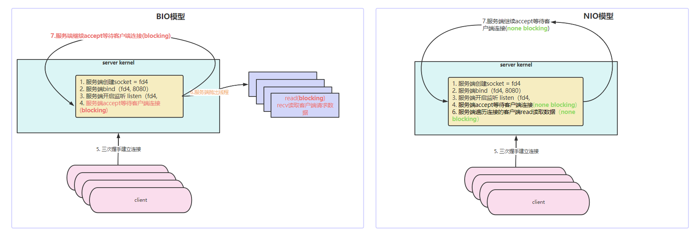
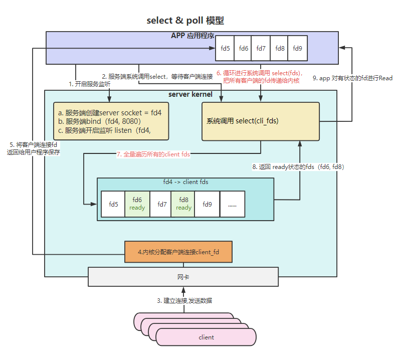
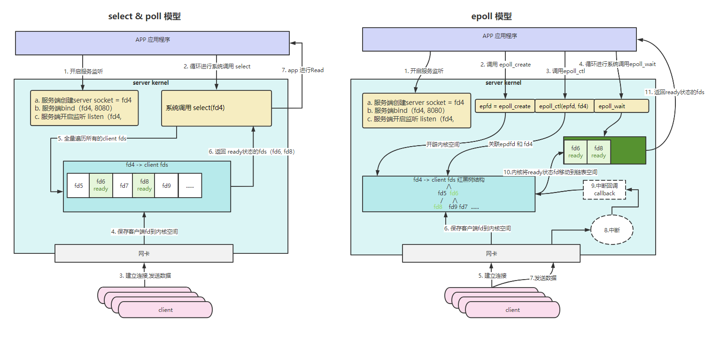

# 计算机基础

## CPU原理

CPU计算的过程其实就是给CPU针脚进行通电断电，

电信号存放在内存中，通过CPU总线传输给CPU进行计算

计算机通电 -> CPU读取内存中的程序(电信号的输入) -> 时钟发生器不断震荡通断电->推动CPU一步步执行(执行多少步取决于指令需要的时钟周期)->计算完成->写回电信号->写给输出设备

CPU计算通过机器语言（如1和0表示）进行计算。

汇编语言的本质：机器语言的助记符，比如利用 10010101 代表add，000111000 代表 mov等等

## CPU的基本组成

- Program Counter 程序计数器(记录当前指令地址)
- 寄存器 Registers 暂时存储CPU计算需要用到的数据
- ALU Arithmetic Unit 运算单元
- CU Control Unit 控制单元
- MMU Memory Management Unit 内存管理单元

## 存储器的层次结构

- 寄存器， < 1ns
- L1（约1ns），L2（约3ns） L3（约15ns） 高速缓存，为CPU内部，其中L3在多核CPU中，是CPU共享的
- L4 主存（约80ns）
- L5 硬盘
- L6 远程文件存储

以上存储层级，从上往下更大更慢

## 按块读取，程序局部性原理

根据空间局部性原理，读取一位数据时，程序很有可能会读取相邻的数据，所以为了减少数据读取产生的IO消耗，CPU读取数据计算，是按块读取，而不是按位读取，这样能够充分发挥总线CPU一次性读取更多数据的能力。

## 缓存行Cache Line

由于局部性原理，CPU读取是按照块进行读取，这个块其实就是一个缓存行，CPU读取数据从L1 -> L2-> L3，如果高速缓存区都没有那么就从主存中读取，最终会缓存到这些L1~L3高速缓存中。

### 伪共享

在多核CPU的时候，这些缓存的数据就会存在同步的问题，所以cpu为了保证缓存一致性，都会遵循一定的协议，如Intel的MESI协议。

当某一个CPU核对缓存行的数据进行了修改，就必须要通知其他也读取了同一个缓存行的核进行数据同步，尤其是在多线程的场景下，两个线程（分别运行在两个核心中）都在修改在同一个缓存行中的不同数据（线程一修改数据A和线程二修改数据B），而缓存的同步是以缓存行为单位的，这样导致互相频繁的通知对方需要重新从主存中读取整个缓存行，从而影响效率，这种现象称之为伪共享。

还有些数据一个缓存行装不下，需要跨越多个缓存行的话，那么为了保证缓存一致性，就必须锁CPU总线。

缓存行越大，局部性空间效率高，但是读取时间慢

缓存行约小，局部性空间效率低，但是读取时间快

所以目前采用一个折中值，如Intel 为64字节

## 内存管理

在早期的操作系统中如Windows9.X，对于内存的管理会存在两个问题：

- 内存空间不够用
- 进程之间对内存的读取和写入，会存在互相打扰

为了解决上述两个问题，采用了**虚拟地址**，分页装入内存，软硬件结合寻址的方案。

1. 分页：内存中分成固定大小的页框（4K），把硬盘上的程序分成4K大小的块，用到哪块的程序才加载到内存，如果内存已经满了，会将最不常用的(LRU算法)内存页数据放到swap分区（硬盘实现，所以效率低），把最新的一块加载进内存页。
2. 虚拟内存：让进程工作在虚拟内存空间中，程序中的内存地址不再是直接的物理内存地址，每个进程都虚拟独占整个CPU和内存空间，A进程也永远都访问不到B进程的内存空间，如果当进程需要访问物理内存空间的数据，需要经过MMU内存映射，将虚拟内存地址映射到真实的物理内存地址。

## 内核态用户态

在操作系统当中，程序大致可以分为两种，一种是用户程序，运行在用户态空间，一类是操作系统内核，运行在内核态空间。

操作系统内核管理着CPU调度，内存分配，硬件资源等，操作系统为了保证稳定，这些敏感资源用户空间程序是无法直接访问的，用户空间程序要想访问必须调用内核提供的函数，也就是系统调用，从用户态切换至内核态才能访问这些敏感资源。

用户态切换至内核态需要经历以下步骤：

* 保留用户态现场（上下文、寄存器、用户栈等）
* 复制用户态参数，用户栈切到内核栈，进入内核态
* 额外的检查（因为内核代码对用户不信任）
* 执行内核态代码
* 复制内核态代码执行结果，回到用户态
* 恢复用户态现场（上下文、寄存器、用户栈等）

这也是用户态切换内核态的成本。

## 系统调用system call

我们在Linux运行中的程序都是属于用户空间，而Linux中的内核是运行在内核空间，当用户程序是无法直接从物理磁盘中读取数据的，而是需要经过系统调用system call，在进行system call 之前用户空间程序需要发送一个cpu的中断int 0x80，cpu读取到该中断信号之后会去寄存器中根据中断向量表找到对应的中断处理callback，比如保护现场，将用户态切换为内核态，进行内核空间的调用



## pagecahe

#### 中断

中断向量表

软中断：应用程序int 80，缺页异常（指的是程序想读写的磁盘中的数据在内存pagecache中不存在，则产生缺页异常，新建页缓存，然后切换为内核态，从磁盘中读取数据填充到页缓存中）

硬中断：时钟中断，IO中断

#### 缺页

## 文件描述符

在Linux系统当中，有一个抽象，一切皆文件fd，并且每一个fd都有自己的指针seek指向真实磁盘上物理文件，即VFS 虚拟文件系统。

Linux中文件类型：

- -: 普通文件（可执行，图片，文本）
- d: 目录
- b: 块设备
- l: 连接: ln -s 软连接（类似于Win系统的快捷方式），ln 硬链接（类似于java中两个引用（虚拟文件系统的文件描述符）指向同一个物理文件）
- c: 字符设备
- s: socket
- p: pipeline 管道
- event poll

在Lunix中，任何进程的PID都能映射到虚拟文件系统中的某个目录，比如echo $$ 可以看到当前进程的PID，然后通过 `cd /proc/{pid}/fd`，目录下都有 `0`（标准输入）`<`，`1`（标准输出）`>`，`2`（错误输出）等等文件描述符。

`exec 5< a.txt` : 表示创建一个文件描述符5的输入指向a.txt。

通过 `lsof -op $$` 就会看到当前进程下出现了一个5的fd

通过 `read a 0<& 5` 然后 `echo $a` 就能看到当前进程的0标准输入从5号文件描述符读取到了a.txt的第一行内容(因为read遇到换行符就会停止)

### Java 中的IO

- BufferedOutputStream 为什么比 FileOutputStream 要快

  FileOutputStream 调用write进行写入的时候每一次调用write就会产生一次系统调用，从而导致用户态和内核态的切换

  BufferedOutputStream 重写了 `write(int b);`方法，并且还内置了一个默认大小为8196个字节的缓冲区 `byte buf[];`，只有当写入的内存超出了buf[]缓冲区的大小才会flush到磁盘中，这样可以减少系统调用而导致的用户态和内核态的切换。
- RandomAccessFile 随机读写：在早期的OutputStream都只提供了写入追加的模式，而RandomAccessFile提供了随机读写的能力，通过seek指针可以改变写入的起点。除此之外，RandomAccessFile还能获取到FileChannel，通过FileChannel的map方法能够开启对文件的内存映射

### Pagecache

内核kernel对内存的管理是以一个个page为单元（4K大小），一个进程对磁盘文件的**读/写**首先会经过系统调用system call ，切换成内核态，然后才能对文件进行读写，而对磁盘的文件读写os操作系统也进行了优化，就是利用pagecache进行页缓存，这样可以有效减少对磁盘的IO次数。

如果一个进程需要读/写磁盘文件，经过system call 切换内核态后，kernel会将数据写入到内存的pagecache中，而对磁盘文件的写入，kernel内核会优先将写入的数据放入到pagecache中，并且这时候pagecache标记为ditry，当dirty 的 pagecahe的数据大小超过一定的阈值，则kernel 会刷写到磁盘，并且移除pagecache的dirty状态。

通过 `sysctl -a | grep dirty`可以查看设置，通过 `vi /etc/sysctl.conf` 进行修改

```shell
vm.dirty_background_bytes = 0
# 代表当pagecache占用到可用内存的10就会触发操作系统内核将
# 那些为dirty的pagecache刷写到磁盘
vm.dirty_background_ratio = 10
vm.dirty_bytes = 0
vm.dirty_expire_centisecs = 3000
# 代表应用程序利用pagecache缓存时，如果达到可用内存的30
vm.dirty_ratio = 30
vm.dirty_writeback_centisecs = 500

```

这时候pagecache还是在内存中，只有当内存不够时，才会将那些不是dirty的pagecache从内存中移除（LRU算法），否则会一直在内存中。

虽然pagecache能够优化IO性能，但是由于是缓存，就会存在数据丢失的问题（比如主机突然断电，pagecache中的内容还没来得及刷写到磁盘）。

在用户空间的程序也有可能存在缓存，比如jdk中的BufferedOutputStream就是当写入的时候在进程堆中分配 8K的 buffered来减少系统调用而导致的用户态内核态切换。

物理磁盘硬件也存在缓存策略(计算机 -> 管理 -> 磁盘 -> 右键属性->策略)



## mmap

# 网络IO

## Socket

lsof -p pid : 查看进程所关联的所有文件描述符

netstat -natp : 查看

tcpdump -nn -i eth0 port 8080: tcp 抓包

客户端向服务端发起连接请求会随机分配一个端口号，而服务端无需为客户端client的连接分配一个随机端口号。

服务端启动，则进入LISTEN状态。

客户端和服务端经历三次握手后，就会开辟一定的资源，并建立连接，即使客户端发送了数据到达服务端，服务端还没有accept分配进程处理，但是数据已经到达**服务端内核**，当服务端进行accept系统调用，就会从进程中里面申请一个文件描述符fd用于对建立连接的socket进行读写操作。

socket 四元组：c_ip - c_port - s_ip-s_port

四元组决定了socket的唯一性

服务端配置：

- back log: 服务端与客户端产生socket连接积压队列长度，指的是存放SYN_RECV状态(半连接)的与ESTABLISHED状态(已完成3次握手，但是没有被应用调用accept取走的连接)的socket的数量，默认大小是50，当积压的socket已经超出该队列的长度，则服务端会拒绝客户端的连接请求，这样可以避免在服务端繁忙时而大量和建立TCP连接而消耗服务器资源。

TCP中的数据窗口:

TCP拥塞控制:

- send buffer
- tcp no delay: 配置数据包是否立即发送，而不是等待buffer缓冲区满再发送
- keepalive: 保持TCP连接，并保持定时发送心跳来监控客户端是否还在线，通过该机制，可以及时的进行释放那些失效连接所占用的资源。

Linux 帮助文档 man man， man 2 socket： 查看socket 系统调用

## 数据到达

我们都知道数据到达会先经过网卡，网卡接收到数据后会产生中断信号，而每个中断信号都会有对应的callback，当cpu接收到中断信号后，会通过回调callback，将网卡发来的数据走内核协议栈最终关联到fd的buffer上，这个时候应用程序通过将一个或者一些fd传输给内核来询问是否有可R/W的时候，才会返回对应的状态，应用程序通过判断返回的状态来决定Read/Write。

## BIO模型

服务端接收客户端连接流程如下：

1. `socket (...) = fd3`系统调用，创建一个文件描述符 fd3，代表服务端进行即将进行LISTEN的Socket
2. `bind(fd3, 8080)`系统调用绑定 fd3 到指定的监听服务端口上，比如8080
3. `listen(fd3, 50) ` ，开始监听，服务端为LISTEN状态
4. 服务端调用 `accept(fd3,` 开始阻塞，等待客户端连接
5. 当有客户端连接到服务端后，`accept(fd3, ....客户端端口，ip)=fd5`调用产生一个新的fd，代表和客户端三次握手建立连接的socket四元组，通过 lsof -p pid 可以查看到对应的文件描述符
6. 服务端抛出一个线程去处理客户端请求，`clone(...)=8447`系统调用创建一个子进程，然后服务端接着进行 `accept(fd3,` 阻塞。

   这一步 clone 创建新线程的成本很高

   **这里为什么服务端需要分配一个线程去处理客户端的请求的原因在于，recv系统调用读取客户端数据是一个阻塞的过程，如果不单独分配线程去读取客户端数据，那么就会导致服务端的主线程（也就是accept的主线程）被阻塞住，从而无法再继续去监听其他客户端的连接。**

从BIO模型可以看出，存在很多 blocking 阻塞的点，这些阻塞的点都会影响处理客户端请求的速度，而且由于服务端主线程只处理accept，对于客户端请求都是采用新建线程或者从线程池中的方式来处理，当大量客户端并发请求压到服务端时，服务端就会消耗大量的时间去进行线程调度，从而浪费服务端资源。



### C10K 问题

## NIO模型

基于OS 的 None Blocking 机制

ServerSocketChannel#accept  设置configureBlocking(false)，非阻塞，NIO中的accept不会产生阻塞，如果没有连接，则返回 null

SocketChannel#read(byteBuffer) 设置 configureBlocking(false)，非阻塞，调用read不会产生则，如果没有数据到达，则返回 null

```java
        // 开启服务端
        ServerSocketChannel serverSocketChannel = ServerSocketChannel.open()
                .bind(new InetSocketAddress("localhost", 8090));
        // 1. 设置服务端监听为非阻塞
        serverSocketChannel.configureBlocking(false);
        while (true) {
            try {
                // 2. 这里accept是非阻塞的
                SocketChannel clientSocket = serverSocketChannel.accept();
                System.out.println("client connected = " + clientSocket);
                if (clientSocket != null) {
                    clients.add(clientSocket);
                }

                // 在NIO下，由于是非阻塞的，可以无需抛出新线程去处理客户端请求，直接在当前线程处理即可
                ByteBuffer byteBuffer = ByteBuffer.allocateDirect(1024);
                for (SocketChannel client : clients) {
                    // 设置非阻塞
                    client.configureBlocking(false);
                    // 设置非阻塞后，read操作就不会进行阻塞
                    int read = client.read(byteBuffer);
                    // 当有数据到达，这里返回值会大于0
                    if (read > 0) {
                        // 利用 ByteBuffer 读取数据
                        byteBuffer.flip();
                        byte[] data = new byte[byteBuffer.limit()];
                        byteBuffer.get(data);
                        System.out.println("接收到：ip:" + client.getRemoteAddress() + ", data:" + new String(data));
                        byteBuffer.clear();
                    }
                }
            } catch (Exception e) {
                e.printStackTrace();
            }
        }
```

所以相对BIO来看，在accept和read两个环节就无需进行阻塞，也无需去为每一个客户端的连接单独分配线程去处理，而是通过一个或者N个线程处理即可，这样减少了频繁创建线程的成本。



NIO的问题，当连接到服务端的数量越来越多，每一次的循环都要由用户空间进程发起系统调用对客户端的socket进行read查看是否有数据到达，这个过程中有很多socket其实是没有数据到达的，那么这些read就是无意义的系统调用，**并且需要用户态和内核态的切换**。

## 多路复用器

为了解决NIO中频繁的针对每一个客户端连接进行系统调用询问是否有数据到达而产生了多路复用器。

采用多路复用器，对于N个客户端的连接，只需要进行一次系统调用，将所有的文件描述符一次性交给内核，内核根据用户态传进来的文件描述符进行遍历获取对应的状态，最终返回每一个连接数据到达状态，然后由程序自己再针对性的进行read/write，因为针对每一个客户端是否有数据到达，内核kernel是第一个知道的，所以判断客户端socket是否有数据，应该交给kernel去实现，这样可以避免频繁的用户态内核态的切换成本。

在IO层面，只要是程序自身进行R/W，那么IO模型就是同步的：

- 同步阻塞：程序自己读取，调用了方法一直阻塞等待有效的返回
- 同步非阻塞：程序自己读取，调用方法会立刻得到返回值（是否有数据到达），然后程序自身决定下一次何时再去读取

在Linux中目前还没有提供内核级的异步IO机制。

多路复用器系统调用有如下三种：

- select(fds, r_fds, w_fds, timeout)  fds文件描述符不能超过1024
- poll(struct pollfd *fds, nfds_t nfds, int timeout)
- epoll event poll 基于事件机制

可以通过手册查询 man 2 select， man 2 poll, man 2 epoll(man 2 epoll_create, epoll_ctl, epoll_wait)

#### select 和 poll 的缺点：

在select和poll两个系统调用中，用户程序想要知道每个fd的状态，**都要用户空间主动把全量的fds都交给内核进行全量的遍历才能够确定fd对应的Ready状态**，即复杂度是一次全量的fds 的遍历，即O(m)。

- 每次用户程序都需要传递全量的fds给内核
- 内核每次都要对全量的fds进行遍历



#### epoll

基于以上的问题，又诞生了epoll，基于事件机制的poll，也就是说，用户空间的fd的状态由用户程序主动系统调用询问转换为由内核主动将Ready状态的fd转移到某个区域（比如说链表空间），然后用户程序只需要去链表空间去处理那些已经是Ready状态的fd即可，而无需将全量的fds交给内核进行遍历。

epoll 主要分为以下三个系统调用：

1. epfd = epoll_create()：创建epoll实例并返回一个文件描述符epfd，在内核会开辟空间（红黑树），用于存储需要加入到epoll中的fd（比如服务端LISTEN状态的fd），如果创建失败则返回-1
2. epoll_ctl(int epfd, int op, int fd, struct epoll_event *event)：将服务端LISTENT 对应的socket的fd和epfd进行绑定，即将fd放入到epoll_create开辟的内核空间(红黑树，大小限制在/proc/sys/fs/epoll/max_user_watches)，并且当有客户端连接时，内核会将已经准备好R/W的客户端socket fd 转移到一个链表空间（专门存放已经I/O ready的fd）。
3. eopll_wait：从epoll_ctl中的链表空间获取客户端的fds。
4. 在最后的epoll_wait获取到有状态的fds之后，应用程序发起read系统调用去读取数据。

epoll 和 select，poll的区别在于：

- select ：用户程序主动进行系统调用将全量的fds传递给内核，而内核每次都需要全量的遍历所有文件描述符来判断状态
- epoll ：在数据到达后，内核会自动的通过中断回调将有状态的文件描述符放入到一个链表内存空间，这样应用程序只需要遍历链表即可获取有状态的文件描述符，而无需进行全量的遍历


