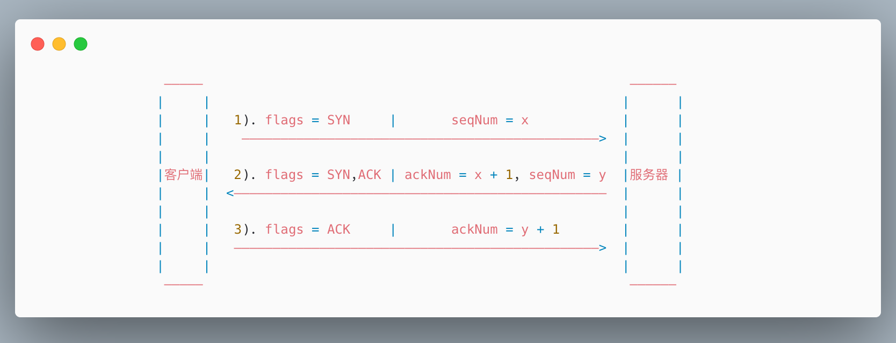

# TCP

客户端和服务器端传输数据需要建立起一个TCP的连接，而TCP不存在连接的的概念，只存在请求和响应，
请求和响应都是基于数据包的形式。

在一个TCP连接上是可以发送多个http请求的，不同的版本这个模式不一样。

在HTTP/1.0中这个TCP连接是在http请求创建的时候同步创建的，http请求发送到服务器端，服务器端响应了之后，这个TCP连接就关闭了；

HTTP/1.1中可以以某种方式声明这个连接一直保持，一个请求传输完之后，另一个请求可以接着传输。这样的好处是：在创建一个TCP连接的过程中需要“三次握手”的消耗，“三次握手”代表有三次网络传输。

## TCP 报文的格式
```cpp
|——————————————————————————————————————————————————————————————————|
|        client ip:port          |      server ip:port             |
|__________________________________________________________________|
|                            sequence num                          |
|——————————————————————————————————————————————————————————————————|
|                            ack num                               |
|——————————————————————————————————————————————————————————————————|
|                            flags                                 |
|——————————————————————————————————————————————————————————————————|
```

1. 序号（sequence number）：Seq序号，占32位，用来标识从TCP源端向目的端发送的字节流，发起方发送数据时对此进行标记。
2. 确认号（acknowledgement number）：Ack序号，占32位，只有ACK标志位为1时，确认序号字段才有效，Ack=Seq+1。
3. 标志位（Flags）：共6个，即URG、ACK、PSH、RST、SYN、FIN等。具体含义如下：
   - URG：紧急指针（urgent pointer）有效。
   - ACK：确认序号有效。
   - PSH：接收方应该尽快将这个报文交给应用层。
   - RST：重置连接。
   - SYN：发起一个新连接。
   - FIN：释放一个连接。

**需要注意的是： 不要将确认序号Ack与标志位中的ACK搞混了。确认方Ack=发起方Seq+1，两端配对。**

## 三次握手



三次握手的过程：

1. 客户端向服务器发送一个TCP的数据包，数据包中的`flags = SYN，seqNum = x`，这时候客户端的状态为`SYN_SENT`。
   
2. 服务器接收到客户端的发送到TCP数据包，通过flags知道客户端是想新建连接，所以服务器结束Listen状态并转为`SYN_RCVD`，并以客户端的`seqNum + 1`，作为确认号，同时
返回服务器的序号`seqNum = y,flags = SYN,ACK`。
   
3. 客户端收到服务器的确认结果后，返回flags = ACK, 确认序号为服务器的sqlNum + 1 也就是 y + 1。

### 为什么需要第三次握手？

因为网络传输其实是有丢包的风险，也有可能会发生网络中断的情况。而第三次握手就是为了在出现这些情况下，避免服务器端开启了一些无用的连接增加，浪费了服务器的
资源，还防止了已经失效的连接突然又传输数据到服务器产生错误。

比如如果在第二次握手服务器返回了应答数据包，但是这时候数据丢失了，客户端一直没有收到，这时候客户端可能因为超时机制，可以重新再发送创建新连接的请求，如果没有
第三次握手，服务器这时候已经返回了应答数据包，表示服务器已经认为连接成功，所以就一直打开着端口等待客户端发送数据，长期以往，就会导致服务器资源的浪费。

## 四次挥手

## OSI网络七层模型

应用层 -> 传输控制层 -> 网络层 -> 链路层 -> 物理层

## 互联网间的通信，TCP/IP协议基于下一跳机制
每个互联网设备不需要存储整个网络下的设备信息，只需要存储周边节点的设备信息.

### 如何寻找下一跳地址?

路由表信息如下：o
```text
[root@VM-16-16-centos ~]# route -n
Kernel IP routing table
Destination     Gateway         Genmask         Flags Metric Ref    Use Iface
0.0.0.0         10.0.16.1       0.0.0.0         UG    100    0        0 eth0
10.0.16.0       0.0.0.0         255.255.252.0   U     100    0        0 eth0
```

将目标ip地址对路由表进行按位与运算（Genmask）得到目标下一跳ip地址

ip是端点间的，mac地址是节点间的

源 IP
源 端口
源 MAC

## ARP协议
地址解析协议，即ARP（Address Resolution Protocol），是根据IP地址获取物理地址的一个TCP/IP协议。主机发送信息时将包含目标IP地址的ARP请求广播到局域网络上的所有主机，并接收返回消息，以此确定目标的物理地址；收到返回消息后将该IP地址和物理地址存入本机ARP缓存中并保留一定时间，下次请求时直接查询ARP缓存以节约资源。

## NAT协议
NAT协议, NAT（Network Address Translation），是指网络地址转换。

## DR


## 基于四层的负载均衡 LVS 

- 
- DR 模型

### 负载均衡的调度算法

- 静态调度
1. rr: 轮循
2. wrr

- 动态调度
1. lc : 最少连接
   负载均衡服务器如何知道哪台服务器的连接数是最少的？
   * 通过三次握手的流程记录，记录第一次SYN和第三次ACK
   * 通过四次次握手的流程记录，记录第二次ACK和第四次ACK
2. wlc: 加权最少连接
3. sed: 最短期望延迟
4. nq: never queue 
5. LBLC: 基于本地的最少连接
6. DH
7. LBLCR: 基于本地的带复制功能的最少连接

### 搭建LVS负载均衡
1. 安装内核交互的软件 `yum install ipvsadm -y `
2. 管理集群服务 `ipvsadm -A -t|u|f <service-address> -s rr`
   * -A 添加, -D 删除 , -E 修改
   * -t|u|f -t: TCP,-u UDP, -f 防火墙标记
   *  -s 调度算法，rr: 轮循
   
如：`ipvsadm -A -t 192.168.100.1 -s rr`
   
3. 管理集群服务的RS服务器` ipvsadm -a -t|u|f <service-address> -r <server-address> [-g|i|m] [-w weight]`
   * -a 添加
   * -t|u|f service-address 事先定义好的负载均衡的服务
   * -r server-address 某RS的服务器地址， 在NAT模型中，可以使用IP:PORT 实现端口映射
   * `[-g|i|m]`: LVS 类型 -g: DR，-i: TUN, -m: NAT
   * `[-w weight]` 权重
   
如： `ipvsadm -a -t 192.168.100.1 -r 192.168.10.1 -g `

4. 保存规则配置 ipvsadm -S > <filepath>

#### 问题
1. LVS 宕机之后，整个服务就不可用，因为从客户端请求的目标IP为LVS服务器的IP，虽然服务器仍然存活，但是客户端无法直接访问到应用服务器。
   解决办法：单点故障，多点
   - 主备
   * 方向性： a) 备用主机主动轮循 b) 主机主动广播
   * 效率性：
2. 远程服务器其中某一台宕机之后，LVS还是会继续对这台已经宕机的服务器进行负载，导致部分客户端会访问失败。
   如何确定RS宕机？ 发送请求，服务器返回200 ok，不能用PING，PING只是网络层
   
以上问题自动化解决方案 -> keepalived

### Keepalived
- 监控自己服务
- Master 通告自己还活着，Backup 监听Master是状态，Master 挂了，Backup 选举一个新的Master
- 配置 vip 添加ipvs keepalive 有配置
- 对后端服务器server 做健康检查

keepalived 是一个通用的工具，主要作为HA实现

nginx 可以作为公司的负载均衡来用，nginx 成为了单点故障也可以使用keepalived解决。

#### 搭建keepalived

1. yum install keepalived -y 
2. 配置
   - /etc/keepalived/
   - 备份配置文件 cp keepalived.conf keepalived.conf.bak 
   - vi keepalived.conf
   - 找到配置项 vrrp_instance 虚拟路由冗余
   - yum install man(帮助文档程序) -> man 5 keepalived.conf(查看keepalived.conf的帮助文档)
   - 
   


