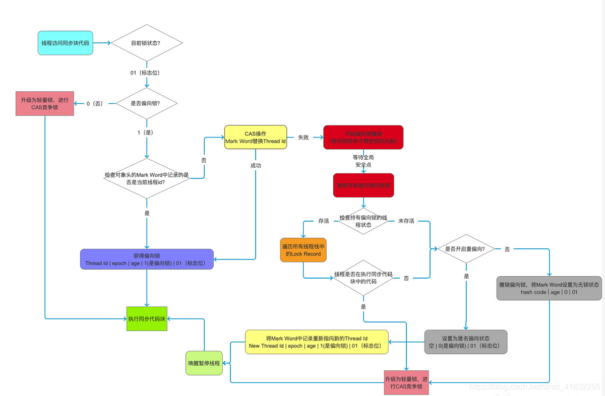

## 概念
- 进程：进程是操作系统的基础，是一次程序的运行，是一个程序及其数据在处理机上顺序执行时所发生的活动，是程序在一个数据集合上运行的过程，
它是系统进行分配和调度的一个独立单元。
- 线程：线程是在进程中独立运行的子任务。
- 多线程：多线程是异步的，千万不要把在IDE中代码的顺序当做是线程的执行顺序，线程被调用的时机是随机的。

## 线程的创建
- 继承Thread，重写run()方法
- 实现Runnable，实现run()方法, 推荐，因为java只能单继承，所以实现接口可以避免局限性
- 利用lambda表达式，实现run()方法/利用线程池 `Executors.newCachedThread()`

线程的启动：new Thread(runnable).start();
如果多次调用start()则会抛出 IllegalThreadStateException;

## sleep yield join
- sleep: 线程休眠，`Thread.sleep(1000)/ TimeUnit.SECONDS.sleep(1)`
- yield: 使当前线程由执行状态，变成为就绪状态(Runnable)，让出cpu时间，在下一个线程执行时候，此线程有可能被执行，也有可能没有被执行。
- join : 当我们调用某个线程的这个方法时，这个方法会挂起调用线程，直到被调用线程结束执行，调用线程才会继续执行。在很多情况下，主线程创建
了子线程，如果子线程需要进行大量耗时的计算，而主线程需要等待子线程的执行完成之后才能执行，这时候就可利用join()。

join()方法内部使用了wait()，也就是说join()方法会释放锁。但是这里需要注意的是，释放的锁对象必须是线程实例，其他的对象实例是不会释放锁的。

线程的六种状态：
- new：当创建线程时，线程就处于new新建状态
- runnable:就绪状态，当创建的线程调用start()方法表示线程处于就绪状态，等待系统调度。
- running: 运行状态，就绪状态的线程获得CPU资源时进入运行状态，Running和Runnable状态可以互相切换，有可能线程Running一段时间后被某个高
优先级的线程强占了CPU的资源，此时线程就从Running状态转变为Runnable状态。
- waiting: 调用wait()，当前线程放弃CPU资源，进度线程等待池中，这种状态线程无法自动唤醒，需要等待其他线程调用notify()或者notifyAll()，
还有就是join()，sleep()方法或者遇到一个阻塞的IO操作。
- time_waiting: join(time), sleep(time)
- blocked：阻塞状态，线程尝试获取同步锁，若同步锁正在被其他线程持有，从而进入阻塞状态。
- terminated：指线程执行完了或者线程执行时发生了异常

线程的优先级
线程的优先级分为1~10个等级

特性：
- 继承性：比如A线程启动B线程，则B线程的优先级与A是一样的。
- 规则性：线程优先级高的，CPU会尽量将执行资源让给优先级比较高的线程。
- 随机性：高优先级的线程不一定会比低优先级的线程先执行完。

守护线程Daemon线程：是一种特殊的线程，当进程中不存在非守护线程，则守护线程会自动销毁，最典型的如GC垃圾回收线程。

## 停止线程 interrupt
真正的线程停止包含：
- 当run() 方法执行完毕
- 使用interrupt() 方法再配合其他方式停止，如 break, return , exception。
- 使用stop() 方法，但是这个方法已经是过期作废的方法了，不推荐使用，会导致某些清理性的工作无法完成，
也会导致对锁住的对象提前解锁产生数据的不一致性。

interrupt()，该方法仅仅是在当前线程打了一个停止的标记，并不是真正的停止，所以是需要通过其他的方式配合来实现真正的线程终止，
具体方法如下：
- interrupt() + break;
- interrupt() + return;
- interrupt() + throw new InterruptedException();

## 暂停线程 

## 死锁
在设计程序的时候一定要避免双方互相持有对方的锁的情况。

## synchronized
如果某一个资源被多个线程共享，为了避免因为资源抢占导致资源数据错乱，即线程安全问题，这时候需要对线程进行同步，
那么synchronized就是实现线程同步的关键字，可以说在并发控制中是必不可少的部分。

具体见[synchronized原理分析](https://github.com/leofeez/java-learning/blob/master/src/main/java/thread/_synchronized/README.md)

对象的结构一共由4部分组成，markword, 类型指针，实例数据，padding(对齐填充)可以利用JOL类库显示

## 锁的分类
乐观锁/悲观锁
独享锁/共享锁
互斥锁/读写锁
可重入锁
公平锁/非公平锁
分段锁
偏向锁/轻量级锁/重量级锁
自旋锁
锁升级
synchronized 默认情况下，使用偏向锁，如果有其他线程争用，升级为自旋锁，类似于while(i< 10) i++, 自旋10次
如果此时还是无法获取到锁，则升级为重量级锁 OS锁
改进后的synchronized并不比Atomic差

偏向锁:

自旋锁，会占用CPU时间，不经过内核态，效率高，适用于加锁的执行时间短，线程数不能多
OS锁（系统锁），适合执行时间长，线程数多

## volatile
作用如下：
- 保证线程可见性：由于每个线程都有自己的工作空间，对于线程共享的变量每个线程会从主存中拷贝一份到当前线程的工作空间内，
大致可分为几个步骤：
    * read和load阶段：从主存中复制变量到当前线程工作空间
    * use和assign阶段：执行代码，改变共享变量
    * store和write：用工作空间内的数据刷新到主存
而由于load，use，assign这三步并不是原子性的操作，就比如 i++，其实可以看作为 i = i + 1;
    + MESI 缓存一致性协议
- 禁止指令重排序
    + DCL单例
    

volatile最大的缺点就是无法保证原子性。

synchronized与volatile的区别如下：
- volatile是线程同步的轻量级实现，所以volatile的性能肯定是比synchronized好，volatile只能修饰变量，
而synchronized可以修饰方法，代码块，在新的JDK中也对synchronized进行了优化，性能也不差。
- 多线程之间使用volatile并不会阻塞线程，synchronized会阻塞线程。
- volatile能保证数据的可见性，但是不能保证原子性，而synchronized可以保证原子性，也可以间接的保证可见性，因为
它会将私有内存和公共内存中的数据进行同步。
- volatile 只是实现可见性，synchronized解决的是线程之间对同一个资源的操作的同步性。
  
## CAS 
Compare And Swap 又称乐观锁，底层依靠CPU的原语实现，在更新值之前会判断是否是期望值，如果不是，则循环等待
cas(expected, update);

实现原理

- 每个线程都会先获取当前的值，接着走一个原子的CAS操作，原子的意思就是这个CAS操作一定是自己完整执行完的，不会被别人打断；

- 在CAS操作里，比较一下，现在的值跟刚才我获取到的那个值，是否相等，是则说明没有人改过这个值，那么将它设置成累加1之后的一个值
- 若有人在执行CAS时，发现自己之前获取的值与当前的值不一样，说明有其他人修改了值，导致CAS失败，失败之后进入一个循环，再次获取值，再执行CAS操作。

CAS使用：

- AtomicInteger：底层利用Unsafe类，能直接操作CPU
- LongAdder：Java8的新类LongAdder，尝试使用分段CAS以及自动分段迁移的方式来提升多线程高并发执行CAS操作的性能，核心思想是热点分离。

CAS 的问题：

- ABA问题：有一个线程将值更新成B，然后做了一些其他的操作，最后又将值更改为A，这中间的操作可能会产生隐藏问题。

  解决方式为加版本号Version，保持递增
  AtomicMarkableReference
  AtomicStampedReference

- 比较和操作要保证原子性

  ```java
  // 判断和设置新值的操作需要保证原子性
  if (expectedValue == value) {
      value = newValue;
  }
  ```

相对于synchronized重量级锁需要等待操作系统调度

由于CAS失败会循环等待，消耗CPU，CAS 在线程数多，操作的时间长的时候会导致CPU飙升，这时候效率不如synchronized

## LOCK 



### ReentrantLock

- 可重入锁，必须显示的去上锁和解锁，上锁和解锁的代码必须放在```try {..} finally{..}```中
- 支持设置等待超时时间```lock.tryLock(5, TimeUnit.SECONDS);```
- 支持被打断，```lock.lockInterruptibly();```
- ReentrantLock默认为非公平的锁，构造方法支持公平锁，新来的线程必选先检查是否有线程在等待锁的队列中，如果有则需要进入等待队列，
  非公平的锁对于新来的线程是有可能会抢到锁.

### CyclicBarrier

### Phaser

### ReadWriteLock
- 共享锁

- 排他锁

### Semaphore
限流，类似于车道和收费站


## AQS

VarHandle：
- 普通属性原子性操作；
- 比反射快，直接操纵二进制码

## ThreadLocal
ThreadLocal叫做线程变量，意思是ThreadLocal中填充的变量属于当前线程，该变量对其他线程而言是隔离的。
ThreadLocal为变量在每个线程中都创建了一个副本，那么每个线程可以访问自己内部的副本变量。

用途：
- 线程间的数据隔离，实现线程安全：如SimpleDateFormat
- 用于存储事务信息，如Spring的声明式事务，保证拿到的都是同一个Connection从而形成一个完整的事务。
- 对象跨层传递：如存储用户信息，UserInfo，防止层与层之间多余的传递。

具体分析见[ThreadLocal源码分析](https://github.com/leofeez/java-learning/blob/master/src/main/java/thread/_threadlocal/README.md)

### Reference
- 强引用：
- 软引用：一个对象在被软引用指向的时候，只有内存不够了才会进行回收，一般用作缓存，如从内存中读取大图片。
- 弱引用：弱引用一遇到gc就会被回收，如ThreadLocalMap中的Entry就是继承于WeakReference
- 虚引用：用于操作堆外内存，

### 内存泄漏，内存溢出