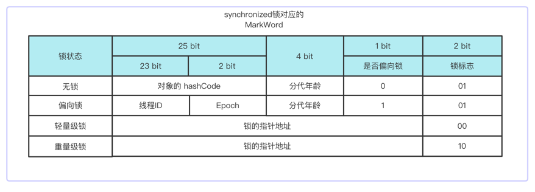

# Synchronized

如果某一个资源被多个线程共享，为了避免因为资源抢占导致资源数据错乱，即线程安全问题，这时候需要对线程进行同步，
那么synchronized就是实现线程同步的关键字，可以说在并发控制中是必不可少的部分。

## 特性

- 原子性：被synchronized修饰的方法或者代码块，在多线程的场景下都是需要先获取锁，再执行，最后释放锁，这中间的
过程无法被打断（除了利用Thread#stop() 方法，已废弃！）。

- 可见性：synchronized对一个类或对象加锁时，一个线程如果要访问该类或对象必须先获得它的锁，而这个锁的状态对于其他任何线程都是可见的，
并且在释放锁之前会将对变量的修改刷新到主存当中，保证资源变量的可见性，如果某个线程占用了该锁，其他线程就必须在锁池中等待锁的释放。

- 有序性：synchronized保证了每个时刻都只有一个线程访问同步代码块，也就确定了线程执行同步代码块是分先后顺序的，保证了有序性。

- 可重入性：当一个线程试图操作一个由其他线程持有的对象锁的临界资源时，将会处于阻塞状态，但当一个线程再次请求自己持有对象锁的临界资源时，
这种情况属于重入锁。通俗一点讲就是说一个线程拥有了锁仍然还可以重复申请锁。

## 介绍

synchronized 取得的锁都是对象锁，而不是把一段代码或者方法当做锁。

synchronized 是可重入锁，在同步方法中调用另外一个同步方法可以直接获取到自己的内部锁，
可重入锁也支持父子间的继承关系，这样就不会产生死锁，因为两次获取的锁都是同一个。

synchronized 是非公平的锁。
程序出现Exception则会释放锁。

写方法加synchronized，但是读方法不加synchronized则容易产生脏读。

synchronized修饰符不支持继承，如果父类定了synchronized，子类重写方法要想实现同步，则也必须加synchronized。

synchronized用在方法上和synchronized(this){整个方法}是同等效果，但是建议锁粒度越小越好，所以推荐使用synchronized代码块。

synchronized(Object): 不能用String常量，Integer, Long, 字符串会存在常量池中
并且锁住的对象不能指向别的实例，所以以对象作为锁的时候必须加final防止指向的地址发生改变。

## 实现原理

要想知道synchronized的实现原理，首先我们先看一下synchronized加锁编译后的字节码内容：

```java
public class Synchronized00 {

    public static void main(String[] args) {
        Synchronized00 obj = new Synchronized00();
        obj.println();
    }

    public void println() {
        synchronized(this) {
            System.out.println("Hello world!");
        }
    }
}
```
对应的字节码文件内容如下：
```text
 0 aload_0
 1 dup
 2 astore_1
 3 monitorenter
 4 getstatic #5 <java/lang/System.out : Ljava/io/PrintStream;>
 7 ldc #6 <Hello world!>
 9 invokevirtual #7 <java/io/PrintStream.println : (Ljava/lang/String;)V>
12 aload_1
13 monitorexit
14 goto 22 (+8)
17 astore_2
18 aload_1
19 monitorexit
20 aload_2
21 athrow
22 return
```

从字节码文件的内容可以看到有一个`monitorenter`和两个`monitorexit`，所以synchronized的底层其实就是依赖这两个指令完成，之所以有两个`monitorexit`是因为在发生异常的时候
需要释放锁，而这两个指令依赖了底层操作系统的锁机制，MutexLock。

synchronized加锁的目标其实都是对象，实际上应该是**加锁对象的monitor**，在HotSpot虚拟机中对应的实现就是`ObjectMonitor`，在`ObjectMonitor`有以下几个重要的属性：
```text
   ObjectMonitor() {
    _count        = 0;      // 记录数
    _recursions   = 0;      // 锁的重入次数
    _owner        = NULL;   // 指向持有ObjectMonitor对象的线程 
    _waiters      = NULL;   // 调用wait后，线程会被加入到_waiters
    _EntryList    = NULL ;  // 等待获取锁的线程，会被加入到该列表
}
```


关于加锁对象如何找到对应的`Monitor`，是由于`Monitor`对应的地址存放于加锁对象的对象头MarkWord当中，下文结合锁升级再详细说明。

整个synchronized加锁的过程可以结合ObjectMonitor的属性来分析：

1. 当多线程产生竞争访问synchronized修饰的方法或者代码块的时候，首先线程会进入到`_EntryList`的列表中，这时候所有线程都会被阻塞住。
   
2. 这时候其中某个线程获取到锁之后，`ObjectMonitor`的_owner设置为当前获取锁的线程，同时该线程从`_EntryList`移除，`_count++`， 并且解除阻塞状态，进入到Running状态。
   
3. 当线程执行完同步方法或者代码块时，`ObjectMonitor`的_owner设置为null，_count--，如果线程在执行时调用了`wait`方法，_owner设置为null，_count--，该线程再回到`_EntryList`中，
等待下一次锁的抢夺。

## synchronized 的优化 - 锁升级

JDK1.5之前早期的时候，synchronized 是重量级的锁，效率比较低，因为synchronized重量级锁其实还是，使用该方式
需要将当前线程进行挂起，然后由用户态切换为内核态去操作，这种切换的代价是很昂贵的，所以JDK1.7增加了锁升级，避免了在某些情况下去做用户态的切换，
提升了synchronized的效率。

锁升级的方向如下：

```
无锁 > 偏向锁 > 轻量级锁 > 重量级锁
```

- 无锁状态：
- 偏向锁：
- 轻量级锁：
- 重量级锁：

关于以上这些锁的原理，首先我们看一下加锁对象的对象头MarkWord：




参考文章：
>https://blog.csdn.net/zzti_erlie/article/details/103997713