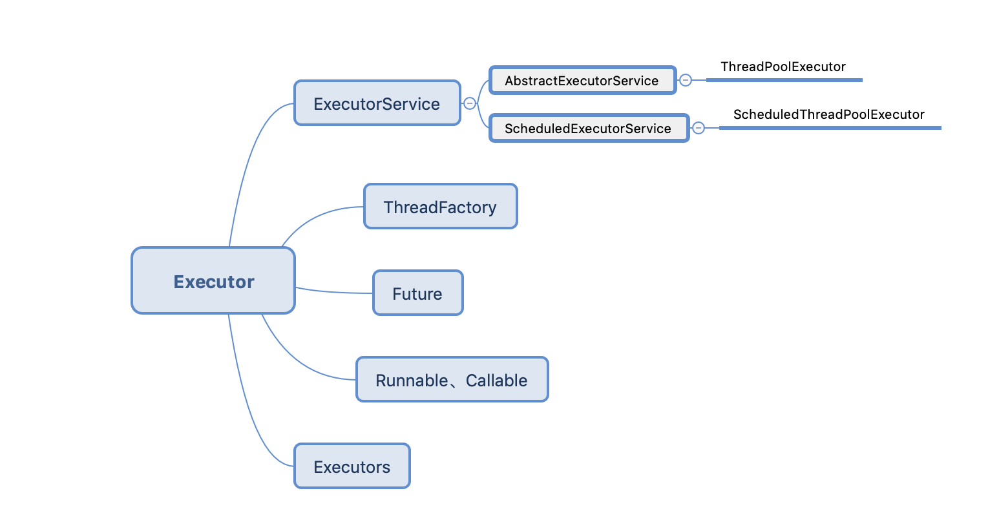

# 线程池

为什么要有线程池？

首先可以看一下在没有线程池的情况下创建线程的方式如下：

```java
new Thread(() -> {
  // do something
}).start();
```

但是如果在实际项目中利用此方式，必然没有办法控制线程数的合理性，而大量的创建线程必然会引出以下两个问题：

- 创建和销毁线程对象是需要消耗CPU资源，线程对象的回收也需要依靠JVM的GC
- 创建大量的线程对象也会浪费内存空间，严重时可能会导致OOM

所以线程池就是为了能够实现线程的复用，在线程池中总会有一些线程处于活跃状态，当你需要线程对象的时候只需要从线程池中获取，当完成对应的工作之后，并不是直接将线程关闭，而是将该线程对象退回到线程池中等待别的工作去复用。


### Executor

为了能够对线程进行有效的控制，在JDK1.5之后提供了Executor框架，该框架的目的就是为了将线程的创建、运行进行集中的管理，从而避免了线程的滥用。

Executor的定义如下：

```java
public interface Executor {

    /**
     * Executes the given command at some time in the future.  The command
     * may execute in a new thread, in a pooled thread, or in the calling
     * thread, at the discretion of the {@code Executor} implementation.
     *
     * @param command the runnable task
     * @throws RejectedExecutionException if this task cannot be
     * accepted for execution
     * @throws NullPointerException if command is null
     */
    void execute(Runnable command);
}
```

Executor是整个框架的最顶层接口，execute(Runnable cmd)的实现还是交由具体的实现类去处理，比如可以直接new Thread(command).start()，或者以线程池的方式创建并执行command。

整个框架的核心成员如下：



### ExecutorService

ExecutorService接口继承于Executor，提供了更多的扩展接口，完善了整个线程池的生命周期，

```java
/**
 * 关闭当前线程池，不再接受新的执行任务，
 * 等待最后一个submit的任务执行完毕，线程池就会关闭，而不是暴力的去关闭线程池。
 */
void shutdown();

/**
 * 判断当前线程池是否已经关闭
 */
boolean isShutdown();

/**
 * 提交要执行的返回值任务，并返回表示任务的未决结果的Future。
 * Future的get方法将在成功完成后返回任务的结果。
 */
<T> Future<T> submit(Callable<T> task);
```

### ScheduledExecutorService

基于ExecutorService扩展了可对线程任务进行调度的线程池，当线程任务提交到线程池中后不一定是立即执行的，可以指定任务的延迟执行时间和任务的执行周期，主要有以下几个方法：

```java 
// 在给定的延迟时间后开始执行任务
public ScheduledFuture<?> schedule(Runnable command, long delay, TimeUnit unit);

// 创建并执行一个周期性的任务，任务开始于给定的初始延迟时间，后续的任务
// 会按照给定的周期进行执行，即后续的第一个任务将在 initialDelay + period 时执行
public ScheduledFuture<?> scheduleAtFixedRate(Runnable command,
                                                  long initialDelay,
                                                  long period,
                                                  TimeUnit unit);
// 周期性执行任务，与上一个方法同不的是，后续的第一个任务在上一个任务执行完成后再延时执行
public ScheduledFuture<?> scheduleWithFixedDelay(Runnable command,
                                                     long initialDelay,
                                                     long delay,
                                                     TimeUnit unit);
```

### Future和Callable

#### Future

从上面的ExecutorService看到submit方法接收一个Callable任务对象，返回了一个线程执行结果Future对象，在往常的Thread线程的执行任务是实现Runnable接口，Runnable接口的run()方法没有返回值，而Future对象就是在线程池中的线程任务完成后可以通过get方法拿到线程完成后的返回值。

```java
// 创建线程池
ExecutorService executorService = Executors.newFixedThreadPool(2);
// submit线程执行任务
Future<String> future = executorService.submit(() -> {
  // 当线程池中的执行任务完成后的返回值
  return "I'm completed";
});
String result = future.get();
System.out.println("拿到任务的返回值为：" + result);
executorService.shutdown();
```

Future的get方法会等待线程池的执行任务完毕并返回，如果执行任务还未完成就调用get方法会阻塞当前线程。

#### FutureTask

同时支持 Ruunable/ Callable 和 Future 的功能

#### CompletableFuture

对多个Future的结果进行管理

```java
CompletableFuture.supplyAsync(runnable);
CompletableFuture.allOf(...);
```


### ThreadPoolExecutor

在整个Executor框架中，Executor和ExecutorService定义了线程池应该有的行为（这也就是接口的职责所在），而ThreadPoolExecutor就是线程池的具体实现，在ThreadPoolExecutor中如下7个核心的参数：

- corePoolSize：核心线程数量

- maximumPoolSize：最大线程数量

- keepAliveTime：当线程池中线程数量超过corePoolSize时，多余的空闲的线程最大闲置时间

- timeUnit：keepAliveTime的时间单位

- workQueue：为BlockingQueue，任务队列，即已提交线程池但还未被执行的任务队列

- threadFactory：创建线程的工厂，建议自定义线程工厂，实现`ThreadFactory`，指定线程名称的生成规则。

- rejectHandler：拒绝策略，在线程池中线程已经用完了，同时等待队列workQueue已经无法加入新的任务的时候会执行拒绝策略，在JDK中内置了以下四种：
  * Abort：抛异常，阻止系统正常工作。
  * Discard：扔掉，不抛异常
  * DiscardOldest：扔掉排队时间最久的
  * CallerRuns:调用者处理任务，比如谁提交了任务，谁去执行

  但大多数情况都需要自定义自己的拒绝策略，实现`RejectedExecutionHandler`接口：

  ```java
  public interface RejectedExecutionHandler {
      void rejectedExecution(Runnable r, ThreadPoolExecutor executor);
  }
  ```

ThreadPoolExcutor 最终是交由内部类 Worker 进行任务的执行，Worker.runWorker() 方法中提供了beforeExcute前置处理和afterExcute后置处理，还有terminate在线程池关闭时进行一些处理。

```
线程池大小的经验公式为：nThreads = Ncpu * Ucpu *（1 + W/C）
- Ncpu: cpu的核心数，Runtime.getRuntime().availableProcessors();
- Ucpu: 期望的Cpu使用率， 0 <= Ucpu <= 1
- W/C: 等待时间与计算时间的比例
```

### ForkJoinPool

- 分解汇总的任务
- 用很少的线程可以执行很多的任务（子任务）TPE做不到先执行子任务
- CPU密集型

采用分而治之的思想

### Executors

Executors是线程池的工厂类，通过Executors可以取得各种具有特定功能的线程池，Executors其实就是封装了ThreadPoolExecutor的实例化，主要有以下几个工厂方法：

- newFixedThreadPool(int nThreads)：返回一个固定线程数量的线程池，该线程池中的线程数量始终不变，当有新的任务提交时，如果有空闲的线程则立即执行，否则进入等待队列。

  > 适用于任务量比较平稳的情况。

  ```java
  public static ExecutorService newFixedThreadPool(int nThreads) {
  		// corePoolSize 和 maximumPoolSize 都设置为 nThreads
    	return new ThreadPoolExecutor(nThreads, nThreads,
                                    0L, TimeUnit.MILLISECONDS,
                                    new LinkedBlockingQueue<Runnable>());
  }
  ```

- newWorkStealingPool(int parallelism)：

  ```java
  public static ExecutorService newWorkStealingPool(int parallelism) {
    	return new ForkJoinPool(
      				 parallelism,
               ForkJoinPool.defaultForkJoinWorkerThreadFactory,
               null, true);
  }
  ```

- newSingleThreadExecutor()：返回一个只有一个线程的线程池，若有额外的任务提交到线程池则会进入等待队列。

  > 缺点是LinkedBlockingQueue 是一个无界的队列，任务量大会导致大量任务堆积，最终可能导致OOM。

  ```java
  public static ExecutorService newSingleThreadExecutor() {
     	// corePoolSize 和 maximumPoolSize 都为 1
      return new FinalizableDelegatedExecutorService
          (new ThreadPoolExecutor(1, 1,
                                  0L, TimeUnit.MILLISECONDS,
                                  new LinkedBlockingQueue<Runnable>()));
  }
  ```

- newCachedThreadPool(): 返回一个可以根据实际情况调整线程数量的线程池，该线程池的线程数量不确定，若有空闲的可复用的线程则会优先使用可复用的线程，若没有空闲的，又有新的任务提交到线程池则会创建新的线程处理任务，所有的线程的任务都执行完毕后将返回线程池进行复用。

  > 缺点是由于SynchronousQueue是手把手的机制，新的任务来必须没有空闲线程则会立即创建新的线程，在任务量大的时候会持续不断的创建线程。
  >
  > 适用于任务量忽高忽低，保证任务来了能够及时处理。
  
  ```java
  public static ExecutorService newCachedThreadPool() {
  		return new ThreadPoolExecutor(0, Integer.MAX_VALUE,
                                      60L, TimeUnit.SECONDS,
                                        new SynchronousQueue<Runnable>());
  }
  ```
  
  从以上几种线程池对象可以看出，主要区别就在于实例化ThreadPoolExecutor的参数不一样。

